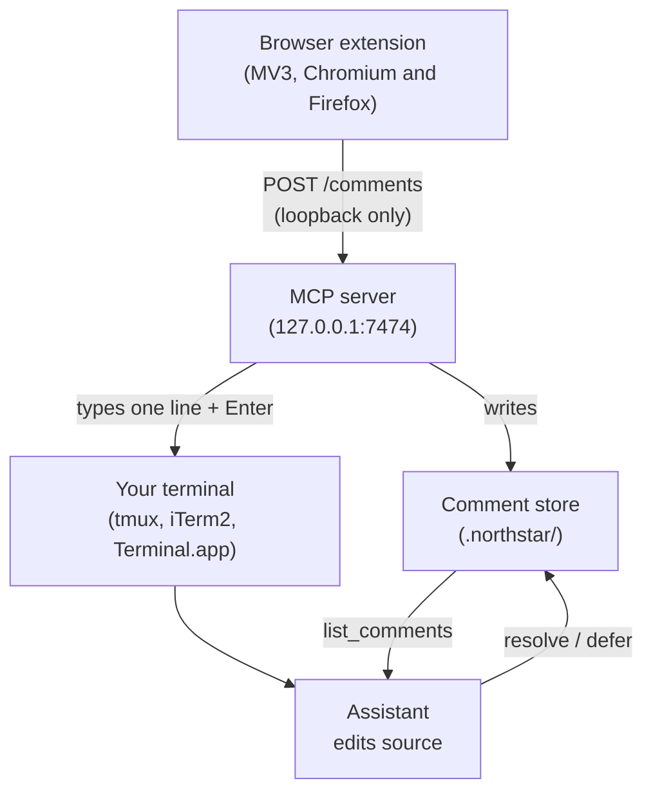

<a name="readme-top"></a>

<br />
<div align="center">
  <a href="#">
    
  </a>
  <h3 align="center">Northstar</h3>

  <p align="center">
    Click any element on a running frontend, leave a comment, and let your
    AI coding assistant implement the change directly in source.
    <br />
    <br />
    <a href="https://github.com/pallandir/northstar/issues">Report a bug</a>
    <a href="https://github.com/pallandir/northstar/issues">Request a feature</a>
  </p>

  <p align="center">
    <a href="./LICENSE.md">
      
    </a>
    <a href="https://www.npmjs.com/package/@pallandir/northstar">
      
    </a>
    = 20">
    
  </p>
</div>

## Table of contents

- [What is Northstar](#what-is-northstar)
- [Prerequisites](#prerequisites)
- [Getting started](#getting-started)
- [How it works](#how-it-works)
- [Usage](#usage)
- [Source mapping](#source-mapping)
- [Compatibility](#compatibility)
- [FAQ](#faq)
- [Security and privacy](#security-and-privacy)
- [Uninstall](#uninstall)
- [License](#license)

<p align="right">(<a href="#readme-top">back to top</a>)</p>

## What is Northstar

**Northstar** is a browser extension paired with an MCP server. Click any element
on a running frontend, local or a remote preview, leave a structured comment
anchored to it, then click **Send to AI**. Northstar types one line into the
terminal your coding assistant is already running in and presses Enter, and the
assistant implements the changes against your real source files.

There is nothing to pair and no command to paste. Nothing is sent to a remote
backend either: every comment travels over loopback between the browser and a
server running on your own machine.

### Why "Northstar"?

A north star is the one point in the sky that never moves, the thing you steer by
when everything else is drifting. Northstar makes your design intent that fixed
point: you mark where the UI should go, and your assistant moves the code until it
gets there.

<p align="right">(<a href="#readme-top">back to top</a>)</p>

## Prerequisites

| Need | Why | Required? |
|---|---|---|
| Node 20+ | runs the MCP server via `npx` | Yes |
| An MCP-capable AI coding assistant | reads comments and edits your source (Claude Code, Codex, Gemini, or any MCP client) | Yes |
| Chrome, Edge, Brave, Arc, or Firefox 128+ | extension | Yes |
| Your assistant started in tmux, iTerm2, or Terminal.app | lets Send to AI type into it | Yes |
| React, Vue, Svelte, or Angular dev build | precise component, source and route resolution | No, automatic |

<p align="right">(<a href="#readme-top">back to top</a>)</p>

## Getting started

### Step 1 · Register the MCP server

The server is published on npm as
[`@pallandir/northstar`](https://www.npmjs.com/package/@pallandir/northstar) and
runs on demand via `npx`, no global install needed.

**Claude Code**, register it with a single command:

```sh
claude mcp add northstar -- npx -y @pallandir/northstar
```

**Any other MCP client**, add the same command to your MCP configuration:

```json
{
  "mcpServers": {
    "northstar": {
      "command": "npx",
      "args": ["-y", "@pallandir/northstar"]
    }
  }
}
```

---

### Step 2 · Install the browser extension

Install Northstar and pin it to your toolbar.

[**Add to Chrome →**](https://chromewebstore.google.com/detail/northstar/mmpgoabhnlkcgboiiaebeahcbbeeaggb)

For Firefox, build it yourself until the AMO listing is up:

```sh
npm ci
npm run build:firefox
```

Then load `extension/firefox/dist` through `about:debugging` > This Firefox >
Load Temporary Add-on. The first time you activate Northstar, Firefox asks for
access to `localhost`. Grant it, or the extension cannot reach the server.

---

### Step 3 · Start commenting

Open your frontend on a `localhost` dev server, with your assistant running in
the same repo **from a terminal**, and click the Northstar toolbar icon. Mark up
the page, then click **Send to AI**.

That is the whole setup. Northstar finds the terminal your assistant runs in,
waits for it to be idle, and types a one-line request followed by Enter.

> [!TIP]
> **Run your assistant in auto mode** so it applies changes without stopping on
> every edit. In Claude Code press `Shift+Tab` to cycle to "accept edits", or
> start with `claude --permission-mode acceptEdits`. Northstar will not answer a
> permission prompt for you: if one is on screen when you send, your comments are
> saved and the toolbar tells you they were not announced.

> [!IMPORTANT]
> The comment store (`.northstar/design-comments.md`) and screenshots
> (`.northstar/design-shots/`) are written to the project root where your MCP
> client is running and are gitignored. Keep them out of version control.

<p align="right">(<a href="#readme-top">back to top</a>)</p>

## How it works



The extension activates per-tab when you click its toolbar icon. Each saved item
carries a stable selector, its own text, and, resolved automatically by a script
Northstar injects into the page's own main world, the rendering component, the
route, and, wherever the framework tracks it, a precise `file:line:column` that
anchors the edit to the right source location. No plugin to install; it reads
state a development build already exposes. On a `localhost` dev server the
extension posts the whole batch to the MCP server running in your project, and the
server types a one-line request into the terminal your assistant is running in. The
assistant reads the batch through the MCP tools and applies it directly at the
location named, rather than searching for it. Comments that need deeper thought
are parked for later, and a notice appears in the browser toolbar.

The line typed into your terminal is a fixed constant. Your comment text is never
typed, it is read from the store, so nothing arriving over HTTP can influence what
your assistant is told to do.

For a deeper look at the architecture and the message flows, see the
[docs folder](./docs).

<p align="right">(<a href="#readme-top">back to top</a>)</p>

## Usage

Day to day, Northstar runs in one of two modes depending on where your frontend
lives.

### Online · localhost dev server

Your assistant runs in the repo and comments flow to it live over loopback.

1. **Leave comments.** Point at any element and one popover opens with three
   tabs: **Comment** to leave a note, **Text** to edit its copy, **Colour** to
   change its text, background, or border colour. Text and colour edits preview
   live against the page as you type. Each saved item is pinned to its element
   and listed in the toolbar drawer.

2. **Send to AI.** Saving queues an item locally; clicking **Send to AI**
   flushes the batch to the server. Your assistant applies each comment directly
   to your source, then marks it resolved. Comments that need more thought (new
   dependencies, cross-cutting changes, or anything you flag "Plan this first")
   are parked in `.northstar/northstar-deferred.md` and a notice appears in the
   toolbar.

Keep your assistant in auto (accept-edits) mode so each batch is applied without a
prompt on every edit.

### Offline · remote preview or no local project

There is no local server to reach, so you export the batch and hand it to any
assistant.

1. **Leave comments** on the remote preview the same way as online.

2. **Handoff.** Click **Handoff** to download a Markdown report of the batch.
   Give that report to any AI coding assistant to implement the changes.

<p align="right">(<a href="#readme-top">back to top</a>)</p>

## Source mapping

Comments always carry a stable CSS selector, the element's own text, and its
route as a baseline. On top of that, Northstar injects a small script into the
page's own main world the moment you activate it, the only place a framework's
debug state is visible, and asks it directly for the rendering component, the
exact source location, and the route pattern. Nothing to install for this; it
reads state your development build already exposes.

| Framework | What resolves |
|---|---|
| React (18 and 19) | Component stack, `file:line:column`, route (Next.js, React Router) |
| Vue 2 and 3 | Component stack, source file, route (Vue Router, Nuxt) |
| Svelte | Component location |
| Angular | Component name, source file where the build exposes it |

When none of that is reachable, for a production build, or a framework outside
this list, a comment still carries the stable selector and route rather than
degrading to a raw XPath. A route Northstar could not confirm against the page's
own router is marked as inferred, so your assistant treats it as a hint rather
than a fact.

<p align="right">(<a href="#readme-top">back to top</a>)</p>

## Compatibility

Northstar's MCP server speaks standard MCP over stdio and works with any
MCP-capable AI coding assistant, Claude Code, Cursor, Windsurf, and similar
clients all connect the same way.

The extension is Manifest V3 and builds for both engines from one source tree:
`npm run build:chromium` for Chrome, Edge, Brave and Arc, `npm run build:firefox`
for Firefox 128+. Plain `npm run build` builds both, plus the MCP server. Firefox
128 is the floor because the overlay needs the Popover API to reach the top layer.

### Terminals

**Send to AI** types into the terminal your assistant runs in, so that terminal has
to be one Northstar can drive.

| Terminal | Support | Notes |
|---|---|---|
| tmux | Yes | Preferred whenever `TMUX_PANE` is set, and needs no OS permission |
| iTerm2 | Yes | Prompts once for Automation access |
| Terminal.app | Yes | Needs Accessibility permission in System Settings |
| Anything else, including editor terminals | No | Comments are still saved, the toolbar says they were not announced |

Set `NORTHSTAR_TERMINAL` to force a driver (`tmux`, `iterm`, `terminal-app`, or
`none`), or `NORTHSTAR_INJECT=0` to turn the typing off entirely.

### MCP tools

The server exposes 6 tools that any MCP client can call directly:

| Tool | Purpose |
|---|---|
| `list_comments` | List comments, optionally filtered by status (`open`, `resolved`, `wontfix`) |
| `resolve_comment` | Set the status of a single comment |
| `resolve_comments` | Resolve or wontfix multiple comments in one call |
| `defer_comment` | Park a comment for planning and notify the browser toolbar |
| `list_deferred` | List comments that were deferred with their reasons |
| `clear_resolved` | Remove all non-open comments from the store |

<p align="right">(<a href="#readme-top">back to top</a>)</p>

## FAQ

<details>
<summary><strong>I sent comments but the assistant never picked them up.</strong></summary>

Comments only leave the browser when you click **Send to AI**. **Save** enqueues a
comment locally, **Send** flushes the batch.

If you did click Send, the toolbar tells you why nothing was typed. The usual
reasons are that your assistant was showing a permission prompt (Northstar will not
answer one for you, send again once it clears), or that it is running somewhere
Northstar cannot type, such as an editor's built-in terminal. Start it from tmux,
iTerm2 or Terminal.app instead.
</details>

<details>
<summary><strong>Northstar typed the line but my assistant did not run it.</strong></summary>

The Enter is sent as a separate keystroke a moment after the text, because assistant
TUIs fold a return arriving inside a fast burst into the pasted text. If the line
lands in the prompt but never submits, the terminal is probably still busy. Press
Enter yourself and open an issue with your terminal and assistant versions.
</details>

<details>
<summary><strong>The extension says it cannot reach the server.</strong></summary>

The server listens on loopback only, so the page you are commenting on must be a
`localhost` or `127.0.0.1` dev server, and your MCP client must be running in the
project (starting the client launches the server). On a remote preview there is
no local project to edit, so Northstar keeps comments in the browser and you export
them with **Handoff** instead.
</details>

<details>
<summary><strong>Port 7474 is already in use.</strong></summary>

The server automatically falls back to 7475, then 7476, and the extension probes
the same range, so a busy port usually just works. To pin a specific port, set
`NORTHSTAR_PORT` in the environment where your client launches the server.
</details>

<details>
<summary><strong>Can two projects run Northstar at once?</strong></summary>

Each project's assistant starts its own server, and they take 7474, 7475 and 7476 in
turn. The extension talks to the most recently started one, so switching projects
works but commenting on two at the same time does not. Set a different
`NORTHSTAR_PORT` per project if you need them pinned.
</details>

<details>
<summary><strong>Where is my data stored, and does anything leave my machine?</strong></summary>

Everything stays local. Queued comments live in the browser's extension storage;
once sent, they are written to a gitignored `.northstar/` folder at your project
root. Nothing is sent to any remote server, and there is no analytics or
telemetry. See [PRIVACY.md](./PRIVACY.md).
</details>

<details>
<summary><strong>Where do I install Northstar?</strong></summary>

Two pieces. Install the extension from the
[Chrome Web Store](https://chromewebstore.google.com/detail/northstar/mmpgoabhnlkcgboiiaebeahcbbeeaggb),
then register the MCP server with your assistant, for Claude Code that is
`claude mcp add northstar -- npx -y @pallandir/northstar`. See
[Getting started](#getting-started) for the full walkthrough.
</details>

<details>
<summary><strong>How do I report a security issue?</strong></summary>

Please do not open a public issue. Use a
[GitHub security advisory](https://github.com/pallandir/northstar/security/advisories/new).
Full details are in [SECURITY.md](./SECURITY.md).
</details>

<p align="right">(<a href="#readme-top">back to top</a>)</p>

## Security and privacy

Everything stays on your machine. The MCP server binds to `127.0.0.1` only and
rejects any request whose `Host` header is not loopback (anti-DNS rebinding) or
whose `Origin` is not a browser extension origin (blocking CSRF from web pages).
The extension's only network access is that loopback listener; it has no standing
access to any page. `activeTab` grants access to one tab for as long as it stays
on the current URL, and that access is revoked on navigation.

See [SECURITY.md](./SECURITY.md) for the full threat model and
[PRIVACY.md](./PRIVACY.md) for data handling details.

<p align="right">(<a href="#readme-top">back to top</a>)</p>

## Uninstall

Removing Northstar is three independent steps; do the ones that apply to you.

1. **Remove the browser extension.** Open `chrome://extensions`, find the
   Northstar card, and click **Remove**. In Firefox, use `about:addons`. This also
   clears the extension's local comment queue.

2. **Remove the MCP server registration.** Delete the `northstar` entry from your
   assistant's MCP configuration.

3. **Delete the local comment store.** The server writes everything into a
   gitignored `.northstar/` folder at your project root. Delete it to remove all
   comments, deferrals, and screenshots:

   ```sh
   rm -rf .northstar
   ```

<p align="right">(<a href="#readme-top">back to top</a>)</p>

## License

This repository is under the **PolyForm Noncommercial License 1.0.0**. You may
use, modify, and share it for noncommercial purposes. All commercial rights are
reserved by the copyright holder. See [LICENSE.md](./LICENSE.md) for the full
terms and commercial licensing contact.

<p align="right">(<a href="#readme-top">back to top</a>)</p>
