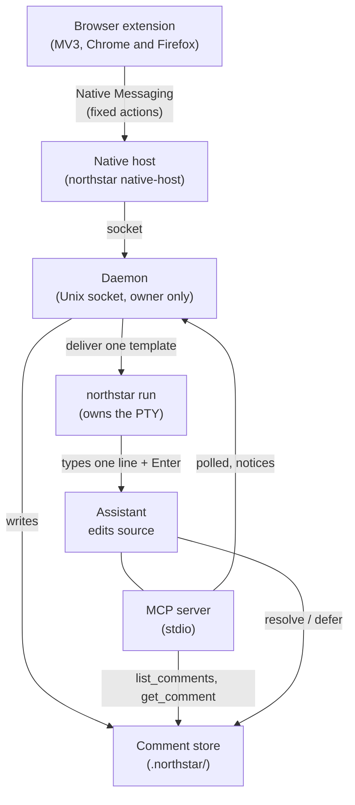

<a name="readme-top"></a>

<br />
<div align="center">
  <a href="#">
    
  </a>
  <h3 align="center">Northstar</h3>

  <p align="center">
    One install for designing, refining and polishing real UI with an AI coding
    agent. Engineers build fast with sensible, professional defaults. Designers
    refine what was built, in the editor or by commenting on the running page.
    <br />
    <br />
    <a href="https://github.com/pallandir/northstar/issues">Report a bug</a>
    <a href="https://github.com/pallandir/northstar/issues">Request a feature</a>
  </p>

  <p align="center">
    <a href="./LICENSE.md">
      
    </a>
    <a href="https://www.npmjs.com/package/@pallandir/northstar">
      
    </a>
    = 20">
    
  </p>
</div>

## Table of contents

- [What is Northstar](#what-is-northstar)
- [The design engine](#the-design-engine)
- [How a project goes](#how-a-project-goes)
- [Prerequisites](#prerequisites)
- [Getting started](#getting-started)
- [Try the local demo](#try-the-local-demo)
- [How it works](#how-it-works)
- [Usage](#usage)
- [Source mapping](#source-mapping)
- [Compatibility](#compatibility)
- [FAQ](#faq)
- [Security and privacy](#security-and-privacy)
- [Uninstall](#uninstall)
- [License](#license)

<p align="right">(<a href="#readme-top">back to top</a>)</p>

## What is Northstar

AI agents write working UI quickly, and most of it looks the same. The same grey and
blue palette, the same three equal cards, one flat shadow, a button with no pressed
state. Northstar is what stops that. It gives your agent a design method, a set of
recipes to start from, a generator for the tokens, and a scanner that tells it when
the result has gone generic.

It has two halves that work together.

The **design engine** is an MCP server and a family of skills. You describe what you
want, or hand over a brand file, and the agent picks a style, generates a contrast
checked design system, builds with real libraries instead of hand rolled
primitives, scans its own work and critiques it against a rubric.

The **browser extension** is the feedback loop. Click any element on a running page,
leave a comment pinned to it, then click **Send to AI**. The agent already running
in your project picks the comments up and fixes them with the same design
discipline. It sits idle until then: no polling, no watch mode, no tokens spent
while you work.

Nothing is sent to a remote backend. The extension and the server talk over
loopback on your own machine.

### Who it is for

Two people, usually. An engineer who needs a screen to exist by the end of the day
and wants it to look professional without a design review. A designer who then takes
that screen, cleans it up and moves it forward without rewriting it from scratch.
Northstar gives both the same system, so what the engineer builds is already
something the designer can refine, and what the designer decides is written down in
`DESIGN.md` where the agent reads it next time.

### One install instead of ten

You do not need a separate skill for taste, another for polish, another for
motion and another for fonts. Northstar combines what is useful in the best of them,
rewritten in its own terms, with every disagreement settled in one place. It can
blend styles, for example a minimalist structure with soft surfaces, and adapt to a
brand you already have, and it keeps a professional floor underneath all of it.
`northstar conflicts` finds the overlapping UI skills on your machine and moves them
aside when you say so.

### Why "Northstar"?

A north star is the one point in the sky that never moves, the thing you steer by
when everything else is drifting. Northstar makes your design intent that fixed
point: you mark where the UI should go, and your assistant moves the code until it
gets there.

<p align="right">(<a href="#readme-top">back to top</a>)</p>

## The design engine

```sh
npm install -g @pallandir/northstar
northstar install
```

That sets Northstar up for Claude Code, Codex, Cursor, Gemini CLI and OpenCode, after
showing you exactly what it will change. For the design tools alone, without the browser
comments, `npx -y @pallandir/northstar install --no-host` works without a global install. Then ask your agent for UI work as you
normally would.

| Piece | What it does |
|---|---|
| Archetypes | Twelve style recipes: minimalist, soft, warm, precise, technical, dense data, editorial, swiss, brutalist, bold, playful and luxury. Pick one, or blend a primary with a secondary that lends its surfaces, type or motion |
| Token generator | `design_tokens_generate` builds a whole system from an archetype and an optional brand colour: a neutral ramp tinted toward the hue, an accent and status colours, light and dark themes, layered shadows, nested radii, a type scale with tracking, and motion tokens. Every colour pair is checked for contrast, and it stops with a fix if one cannot pass |
| Finish layer | The details that make a screen feel done: depth from a ring plus soft layers, concentric corners, balanced headings, tabular figures, hit areas, and a full set of states for every control |
| Detector | `northstar detect`, the `slop_scan` tool and an edit hook flag generic patterns and missing finish, such as `100vh`, a single black shadow, a button with no pressed state, `ease-in`, or a palette taken straight from the Tailwind defaults |
| Audit | `slop_scan` with `inventory` true counts the colours, radii, shadows, sizes and spacing in existing code, shows the drift from `DESIGN.md` and says which thing to fix first |
| Library first | `resolve_library`, `resolve_font` and `resolve_icon` pick shadcn, an icon set, Fontsource and friends for your stack, so nothing gets hand rolled |
| Your direction | `design_md_normalize` turns any markdown into a valid `DESIGN.md`. It also reads a Figma design system when the official Figma MCP server is installed |
| Rubric | `critique_rubric` scores a built screen on nine dimensions, with weights per mode and caps for accessibility and detector failures |
| Page audit | `page_audit` renders your running page in headless Chrome at 390 and 1440 wide, reads the real DOM and styles, and runs rules the source cannot show: competing primary actions, nested cards, contrast, focus, target size, overflow, type scale, heading order, the default centred hero and more. It returns the top findings by impact with crops and a repair plan |
| Self feedback | Repair, audit again, then `page_compare` shows what was resolved, what was introduced and how many pixels moved. The loop stops after four audits, and `design_report` writes the evidence, never a score |
| References | `design_intent`, `references_search` and `design_direction` find references on Dribbble, Pinterest and Awwwards, measure or record their Design DNA and build a direction from principles, never a copy of one site |

### Five skills, loaded only when needed

| Skill | Use it for |
|---|---|
| `northstar` | The core: the DESIGN.md gate, the method, the rules and every reference |
| `northstar-build` | New UI from a brief |
| `northstar-refine` | Improving UI that already exists |
| `northstar-finish` | The last detail pass before shipping |
| `northstar-review` | A scored, read only design review |

### Search instead of loading

The whole canon is 21 references split into 178 sections, 68 rules, 12 archetypes
and 13 resolved conflicts. An agent never needs all of it, so it does not read it.
`canon_find` takes plain words, fixes typos, understands related terms and returns
ids with a one line summary and a token cost, inside a small budget. `canon_read`
returns one section. A topic id returns an outline rather than the whole file. For
agents without the tools, `references/INDEX.md` is a map of the same sections, and
the skills are short on purpose.

It follows a method, not a mood: brief, direction, system, compose, critique, polish,
in four modes (operate, read, persuade, experience). Read [the method](./docs/method.md),
[the detector](./docs/detector.md) and [setting up your agent](./docs/agents.md). The
[rule index](./docs/canon.md) lists every rule.

<p align="right">(<a href="#readme-top">back to top</a>)</p>

## How a project goes

**New screen.** Ask for it in your own words, or run the `build` prompt. The agent
checks the project, asks at most three questions with a default for each, picks an
archetype, writes `DESIGN.md` from the generated tokens, resolves the libraries,
builds, and scans the result.

```text
Build the plans page for our analytics app. Calm, for workspace owners, operate mode.
Our brand blue is #1E40AF.
```

**Existing screen.** The `refine` prompt starts with an audit, not with opinions. The
agent saves before screenshots, counts what is in the code, then changes one thing at
a time in a fixed order: type, colour, states, spacing, depth, motion, and only then
composition. After each change it rescans and compares screenshots. Routes, labels,
form fields, the logo and legal copy are never touched without asking.

**Feedback from the browser.** A designer clicks, comments and presses **Send to AI**.
The agent resolves each comment at the token or component level when the same fault
repeats, scans what it edited, and records what changed.

**Before shipping.** `northstar-review` scores the screen from screenshots and the
detector, and returns ranked findings without editing anything.

In every case `DESIGN.md` comes first. No UI file is created or edited until it
exists, parses and names a mode, and in Claude Code an edit hook enforces that.

<p align="right">(<a href="#readme-top">back to top</a>)</p>

## Prerequisites

| Need | Why | Required? |
|---|---|---|
| Node 20+ | runs the MCP server via `npx` | Yes |
| An MCP-capable AI coding assistant | reads comments and edits your source (Codex, Claude Code, Gemini, or any MCP client) | Yes |
| Chrome or Firefox 128+ | extension | Yes |
| macOS or Linux | the local helper and the agent sessions use Unix sockets and a pseudo terminal | Yes |
| Your assistant started from a new terminal after `northstar install` | the shell wraps it in a pseudo terminal Send to AI can write to | Yes |
| React, Vue, Svelte, or Angular dev build | precise component, source and route resolution | No, automatic |

<p align="right">(<a href="#readme-top">back to top</a>)</p>

## Getting started

### Step 1. Set up your agent

The package is published on npm as
[`@pallandir/northstar`](https://www.npmjs.com/package/@pallandir/northstar) and
runs on demand via `npx` for the MCP server. The browser helper and the agent
sessions need a permanent install, so install it globally once:

```sh
npm install -g @pallandir/northstar
northstar install
```

`northstar install` registers the two MCP servers (`northstar` for design and `northstar-comments` for applying comments), installs the five skills, adds the edit
hook for every agent it finds, and registers the browser helper (a Native Messaging
host) for Chrome and Firefox. It prints a plan and asks before changing anything. Use
`--agent codex` to choose one agent, `--dry-run` to only look, `--no-host` to skip the
browser helper, and `northstar doctor` to check the result. See
[setting up your agent](./docs/agents.md) for what each agent gets.

To register the server by hand instead, for example for Codex:

```sh
codex mcp add northstar -- npx -y @pallandir/northstar
```

or add the same command to any MCP client configuration:

```json
{
  "mcpServers": {
    "northstar": {
      "command": "npx",
      "args": ["-y", "@pallandir/northstar"]
    }
  }
}
```

The comment tools must be registered under the name `northstar-comments`, and the design
tools under `northstar`. The extension's fixed line and the tool names depend on both,
and `northstar serve comments` starts the comments server.

---

### Step 2. Install the browser extension

Install Northstar and pin it to your toolbar. Clicking the toolbar icon toggles
the overlay on and off for the current tab.

[**Add to Chrome →**](https://chromewebstore.google.com/detail/northstar/mmpgoabhnlkcgboiiaebeahcbbeeaggb)

For Firefox, build it yourself until the AMO listing is up:

```sh
npm ci
npm run build:firefox
```

Then load `extensions/firefox/dist` through `about:debugging` > This Firefox >
Load Temporary Add-on. The first time you activate Northstar, Firefox asks for
access to `localhost`. Grant it, or the extension cannot run on your dev server.

An unpacked Chrome build has a different extension id from the store build, and the
helper only answers extensions it was told about. Copy the id from
`chrome://extensions` and run `northstar install --allow-extension <id>`.

---

### Step 3. Start your agent and comment

`northstar install` wraps every known agent (and any you add with `northstar agent add`)
in your shell, so you start them as usual in a new terminal, from the project folder:

```sh
claude
codex
```

Northstar runs the program inside a pseudo terminal it owns. That works for any
program in any terminal, which is why Send to AI needs no terminal specific support and
no macOS permission. It can only ever write into that terminal. `northstar run <agent>`
does the same without the shell wrapper, and `--no-shell` skips the wrapper at install.

An assistant that was already running, or that a GUI or an IDE started without your
shell, has no session. Choose **Copy the line** once and it connects without a restart.

Unpacked builds of the extension are allowed automatically: when the daemon starts it
finds the Northstar builds loaded in Chrome and allows them. Reload the page after
starting your assistant.

Open your frontend on a `localhost` dev server and click the Northstar toolbar icon
to turn the overlay on. There is nothing to connect or pair. Mark up the page, then
click **Send to AI**. You can also select text on any page and use the right click
menu **Send selection to AI**, or press `Alt+Shift+A`. The shortcut can be changed in `chrome://extensions/shortcuts` or in
Firefox under Manage Extension Shortcuts.

Delivery is automatic. Northstar waits until the assistant has stopped printing,
types one fixed line, and presses Enter for you. It stops and tells you in the
toolbar, with the reason and the fix, only when it must not go on:

| What Northstar found | What the toolbar says |
|---|---|
| The assistant is waiting on a permission or choice prompt | Answer it, then send again. Northstar never answers for you |
| There is text in the assistant's input, or you are typing | Send or clear it, then send again |
| The assistant never stopped printing | Wait for it to finish, then send again |
| The assistant did not read the comments within 20 seconds | Check it for a pending prompt or a running task |
| More than one session runs in the project | Pick the session to send to |
| A comment was parked because it needs a plan | A notice with the comment, so you can plan it |
| Northstar cannot write to your assistant | Choose **Copy the line**, paste it into the assistant once, and Send to AI works from then on |

**Copy the line** copies a start line. Paste it into any assistant, in any terminal or
editor, and it runs `northstar listen`, a command that waits until you click **Send to
AI**. Claude Code runs it as a background task, so waiting costs no tokens and the
click wakes the assistant. Other assistants run it in the shell. After each batch the
assistant runs it again, until you tell it to stop. Comments you send while it is busy
are saved and queued, and the next `northstar listen` returns them at once. The command
never writes into a terminal, and the comment text only ever reaches the assistant
through the saved store. It works even before you have added a comment.

### The resolve-comments prompt

The server also registers an MCP prompt named `resolve-comments`. In Claude Code
you can run it yourself at any time:

```text
/mcp__northstar-comments__resolve-comments
```

It tells the agent to list the open comments, fetch each one with `get_comment`,
implement it at the location the comment names, and resolve it with a note and the
files it changed.

## Try the local demo

Clone the repository and follow the [local demo guide](./examples/react-app/README.md)
to build the MCP server and both browser extensions, load them from your
working tree, and exercise the sample React app with Codex. The example is
intentionally outside the root npm workspaces and CI, so install its dependencies
with `npm ci --prefix examples/react-app`.

> [!TIP]
> **Run your assistant in auto mode** so it applies changes without stopping on
> every edit. Northstar will not answer a
> permission prompt for you: if one is on screen when you send, your comments are
> saved and the toolbar tells you they were not announced.

> [!IMPORTANT]
> The comment store (`.northstar/design-comments.json`) and screenshots
> (`.northstar/design-shots/`) are written to the project root where your MCP
> client is running and are gitignored. Keep them out of version control.

<p align="right">(<a href="#readme-top">back to top</a>)</p>

## How it works


```mermaid
flowchart TD
    A["Browser extension\n(MV3, Chrome and Firefox)"]
    H["Native host\n(northstar native-host)"]
    D["Daemon\n(Unix socket, owner only)"]
    C["Comment store\n(.northstar/)"]
    W["northstar run\n(owns the PTY)"]
    E["Assistant\nedits source"]
    M["MCP server\n(stdio)"]

    A -- "Native Messaging\n(fixed actions)" --> H
    H -- "socket" --> D
    D -- "writes" --> C
    D -- "deliver one template" --> W
    W -- "types one line + Enter" --> E
    E --- M
    M -- "list_comments, get_comment" --> C
    M -- "polled, notices" --> D
    E -- "resolve / defer" --> C
```

The extension activates per-tab when you click its toolbar icon. Each saved item
carries a stable selector, its own text, and, resolved automatically by a script
Northstar injects into the page's own main world, the rendering component, the
route, and, wherever the framework tracks it, a precise `file:line:column` that
anchors the edit to the right source location. No plugin to install; it reads
state a development build already exposes.

The extension talks to Northstar through Chrome and Firefox Native Messaging, not
through a local web server, so there is no port, no pairing token and nothing a web
page can reach. The browser starts `northstar native-host`, which only answers the
Northstar extension, validates every message against a fixed list of actions and
forwards it to a small daemon over a Unix socket that only your user can open. The
daemon keeps the list of running sessions, routes a send to the right one and holds
the comment store access. Each session is a `northstar run` process that owns the
assistant's pseudo terminal, so the write goes straight into that terminal and nowhere
else.

The line written to the assistant is chosen from a short list of fixed templates
(resolve, implement, explain, fix, review, add to task). Your comment text, the
selected text, the page URL and the page title are stored as comment data and read by
the assistant through the MCP tools, they are never typed. Comments that need deeper
thought are parked for later, and a notice appears in the browser toolbar.

For a deeper look at the architecture and the message flows, see the
[docs folder](./docs).

<p align="right">(<a href="#readme-top">back to top</a>)</p>

## Usage

Day to day, Northstar runs in one of two modes depending on where your frontend
lives.

### Online: localhost dev server

Your assistant runs in the repo through `northstar run` and comments flow to it live
through the local helper.

1. **Leave comments.** Point at any element and one popover opens with three
   tabs: **Comment** to leave a note, **Text** to edit its copy, **Colour** to
   change its text, background, or border colour. Text and colour edits preview
   live against the page as you type. Each saved item is pinned to its element
   and listed in the toolbar drawer.

2. **Send to AI.** Saving queues an item locally; clicking **Send to AI**
   flushes the batch to the project. Your assistant applies each comment directly
   to your source, then marks it resolved. Comments that need more thought (new
   dependencies, cross-cutting changes, or anything you flag "Plan this first")
   are parked in `.northstar/northstar-deferred.json` and a notice appears in the
   toolbar.

Keep your assistant in auto (accept-edits) mode so each batch is applied without a
prompt on every edit.

### Offline: remote preview or no local project

There is no local server to reach, so you export the batch and hand it to any
assistant.

1. **Leave comments** on the remote preview the same way as online.

2. **Handoff.** Click **Handoff** to download a Markdown report of the batch.
   Give that report to any AI coding assistant to implement the changes.

<p align="right">(<a href="#readme-top">back to top</a>)</p>

## Source mapping

Comments always carry a stable CSS selector, the element's own text, and its
route as a baseline. On top of that, Northstar injects a small script into the
page's own main world the moment you activate it, the only place a framework's
debug state is visible, and asks it directly for the rendering component, the
exact source location, and the route pattern. Nothing to install for this; it
reads state your development build already exposes.

| Framework | What resolves |
|---|---|
| React (18 and 19) | Component stack, `file:line:column`, route (Next.js, React Router) |
| Vue 2 and 3 | Component stack, source file, route (Vue Router, Nuxt) |
| Svelte | Component location |
| Angular | Component name, source file where the build exposes it |

When none of that is reachable, for a production build, or a framework outside
this list, a comment still carries the stable selector and route rather than
degrading to a raw XPath. A route Northstar could not confirm against the page's
own router is marked as inferred, so your assistant treats it as a hint rather
than a fact.

<p align="right">(<a href="#readme-top">back to top</a>)</p>

## Compatibility

Northstar's MCP server speaks standard MCP over stdio and works with any
MCP-capable AI coding assistant, Claude Code, Cursor, Windsurf, and similar
clients all connect the same way.

The extension is Manifest V3 and builds for both engines from one source tree:
`npm run build:chromium` for Chrome, `npm run build:firefox` for Firefox 128+. Plain `npm run build` builds both, plus the MCP server. Firefox
128 is the floor because the overlay needs the Popover API to reach the top layer.

### Sessions and agents

| Command | What it does |
|---|---|
| `northstar run <agent> [arguments]` | Starts the agent in a session Northstar owns, all arguments go to the agent |
| `northstar sessions` | Lists the running sessions with their project and last activity |
| `northstar agent list` | Shows the agents Northstar knows and whether each is installed |
| `northstar agent add <id> <path>` | Registers your own CLI |
| `northstar shell install` / `uninstall` | Adds or removes the shell functions for zsh, bash or fish |
| `northstar config` | Shows or sets the preferred agent, the default template and site mappings |
| `northstar daemon [stop\|status]` | Runs, stops or inspects the daemon, it starts on demand |
| `northstar doctor` | Checks the install, the browser helper, the pseudo terminal module and the shell |

Claude Code, Codex, Gemini CLI, OpenCode, Aider and Goose are built in, and any other
terminal program works the same way because Northstar never speaks an assistant's
protocol, it only owns the terminal. State lives in `~/.northstar/`: `config.yaml`,
`state/` (session metadata only, never prompts), `logs/` (events, session ids and byte
counts, never comment text) and `run/` for the socket.

The extension options page sets the preferred agent, the default template and which
project a site belongs to, for example `localhost:5173` or `github.com/acme/backend`.
A mapped site sends to its project even from a page that is not on localhost.

Set `NORTHSTAR_HOME` to move the `.northstar` folder, and `NORTHSTAR_ROOT` to choose
the project root the MCP server stores comments in.

### MCP tools

The server exposes 32 tools and 12 prompts, all always available. The prompts are
`resolve-comments`, the stage prompts (`brief`, `direct`, `system`, `compose`,
`critique`, `polish`) and the workflow prompts (`build`, `refine`, `finish`,
`adapt`, `modernise`). The comment tools:

| Tool | Purpose |
|---|---|
| `list_comments` | Compact summaries of open comments by default, or of a given status (`open`, `in_progress`, `resolved`, `wontfix`) |
| `get_comment` | Claim a comment (`open` becomes `in_progress`) and return full detail with an ordered "Where to look" list |
| `resolve_comment` | Set the status of a single comment, with an optional `note` and `files` |
| `resolve_comments` | Resolve or wontfix multiple comments in one call, with optional `note` and `files` each |
| `defer_comment` | Park a comment for planning and notify the browser toolbar |
| `list_deferred` | List comments that were deferred with their reasons |
| `clear_resolved` | Remove all resolved and wontfix comments from the store |

The design tools, by group:

| Group | Tools | Purpose |
|---|---|---|
| core | `northstar_context` | Project state, the gate, Chrome availability and the audit loop |
| core | `canon_find`, `canon_read` | Search the canon within a token budget, read one section or the reasoning for a rule |
| research | `design_search` | Curated styles, palettes, pairings and UX guidance as candidates, or one row in full by id |
| system | `design_tokens_generate`, `design_system_propose` | A generated, validated `DESIGN.md` from an archetype or a short brief |
| system | `design_md_init`, `design_md_normalize`, `design_md_validate`, `design_md_export` | Create, import, check and export `DESIGN.md` as CSS, Tailwind or DTCG |
| resolve | `resolve_library`, `resolve_font`, `resolve_icon` | Pick libraries, fonts and icons for the stack |
| detect | `slop_scan` | Scan UI files, or with `inventory` true audit existing UI |
| critique | `critique_rubric`, `record_critique` | Score a screen and keep the decisions log |
| page | `page_capture`, `page_audit`, `page_compare` | Screenshot and audit the running page in headless Chrome, then compare two runs |
| design | `design_intent`, `references_search`, `references_add`, `references_record`, `design_direction`, `design_report` | Intent, references, direction and the final evidence report |

The page and design tools need Google Chrome installed. When it is missing they answer
that Northstar cannot use this function, nothing is downloaded and nothing else changes,
so comments and Send to AI keep working. `northstar audit <url>` and `northstar capture
<url>` run the same code from a terminal. Runs, references and the direction are saved
under `.northstar/design/` in the project.

<p align="right">(<a href="#readme-top">back to top</a>)</p>

## FAQ

<details>
<summary><strong>I sent comments but the assistant never picked them up.</strong></summary>

Comments only leave the browser when you click **Send to AI**. **Save** enqueues a
comment locally, **Send** flushes the batch.

If you did click Send, the toolbar tells you why and how to fix it. The usual reasons
are that the assistant was showing a permission prompt (Northstar will not answer one
for you, send again once it clears), that there was text in its input, or that it
was not started through Northstar. Open a new terminal and start it again, or run
`northstar doctor`.
</details>

<details>
<summary><strong>The extension says the helper is not installed.</strong></summary>

Run `northstar install`, then reload the page. It writes the Native Messaging manifest
for Chrome and Firefox and a small launcher that pins the Node and Northstar paths it
was installed from. `northstar doctor` checks each file and says which one is missing.
If Chrome says the helper does not allow the extension, you loaded an unpacked build,
see the `--allow-extension` note under [Step 2](#step-2-install-the-browser-extension).
</details>

<details>
<summary><strong>Chrome asked me to accept a new permission after an update.</strong></summary>

The extension now uses Native Messaging to reach the local helper, and Chrome disables
an installed extension until you accept the new `nativeMessaging` permission. Open
`chrome://extensions`, find Northstar and click **Re-enable**.
</details>

<details>
<summary><strong>Can two projects run Northstar at once?</strong></summary>

Yes. Every project's assistant is its own session, and one daemon routes between them.
When more than one project is known, the toolbar binds the page to the project that
owns its source files, then to a mapping you set, and only asks you to choose when
neither decides. With two sessions in one project the toolbar lists them and sends to
the one you pick, or to your preferred agent.
</details>

<details>
<summary><strong>Where is my data stored, and does anything leave my machine?</strong></summary>

Everything stays local. Queued comments live in the browser's extension storage;
once sent, they are written to a gitignored `.northstar/` folder at your project
root. Nothing is sent to any remote server, and there is no analytics or
telemetry. See [PRIVACY.md](./PRIVACY.md).
</details>

<details>
<summary><strong>Where do I install Northstar?</strong></summary>

Two pieces. Install the extension from the
[Chrome Web Store](https://chromewebstore.google.com/detail/northstar/mmpgoabhnlkcgboiiaebeahcbbeeaggb),
then register the MCP server with your assistant, for Codex that is
`codex mcp add northstar -- npx -y @pallandir/northstar`. See
[Getting started](#getting-started) for the full walkthrough.
</details>

<details>
<summary><strong>How do I report a security issue?</strong></summary>

Please do not open a public issue. Use a
[GitHub security advisory](https://github.com/pallandir/northstar/security/advisories/new).
Full details are in [SECURITY.md](./SECURITY.md).
</details>

<p align="right">(<a href="#readme-top">back to top</a>)</p>

## Security and privacy

Everything stays on your machine. There is no local web server: the extension reaches
Northstar through Native Messaging, and the helper it starts only answers the Northstar
extension and accepts a fixed list of actions. The daemon behind it listens on a Unix
socket that only your user can open. Send to AI writes one fixed line, never your
comment text, and only into a session that `northstar run` started, so it cannot type
into any other terminal and needs no accessibility permission. The extension has no
standing access to any page. `activeTab` grants access to one tab for as long as it
stays on the current URL, and that access is revoked on navigation.

See [SECURITY.md](./SECURITY.md) for the full threat model and
[PRIVACY.md](./PRIVACY.md) for data handling details.

<p align="right">(<a href="#readme-top">back to top</a>)</p>

## Uninstall

Removing Northstar is three independent steps; do the ones that apply to you.

1. **Remove the browser extension.** Open `chrome://extensions`, find the
   Northstar card, and click **Remove**. In Firefox, use `about:addons`. This also
   clears the extension's local comment queue.

2. **Remove the MCP server, the skills and the browser helper.**
   `northstar uninstall` removes the server registration, the five skills and the edit
   hook, restores the files it backed up and, once no agent is left, removes the
   browser helper. Run `northstar shell install` in reverse with
   `northstar shell uninstall`, and `northstar daemon stop` to close the daemon. Or
   delete the `northstar` entry from your assistant's MCP configuration and the
   `northstar*` skill folders yourself.

3. **Delete the local comment store.** The server writes everything into a
   gitignored `.northstar/` folder at your project root. Delete it to remove all
   comments, deferrals, and screenshots:

   ```sh
   rm -rf .northstar
   ```

   Northstar's own settings and logs live in `~/.northstar/`, delete that folder to
   remove them.

<p align="right">(<a href="#readme-top">back to top</a>)</p>

## License

Northstar is released under the **MIT License**. See [LICENSE.md](./LICENSE.md) for
the full text and [NOTICE](./NOTICE) for the attribution of the design sources the
canon and data were distilled from.

<p align="right">(<a href="#readme-top">back to top</a>)</p>
