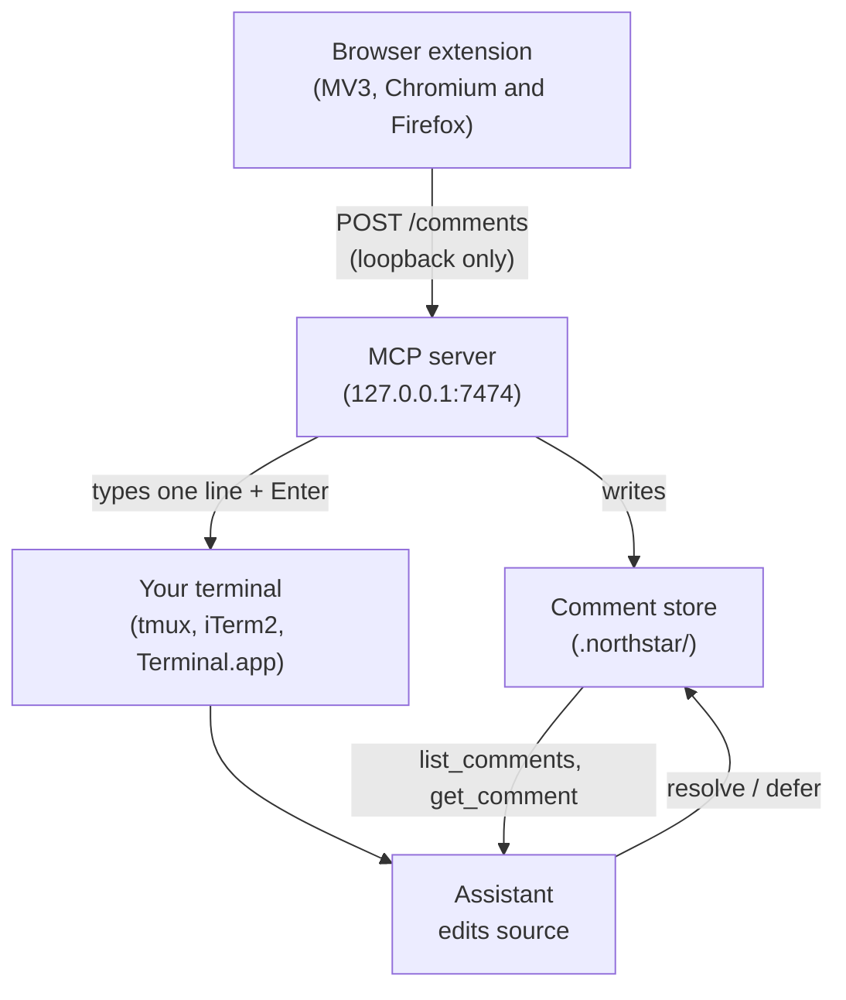

<a name="readme-top"></a>

<br />
<div align="center">
  <a href="#">
    
  </a>
  <h3 align="center">Northstar</h3>

  <p align="center">
    One install for designing, refining and polishing real UI with an AI coding
    agent. Engineers build fast with sensible, professional defaults. Designers
    refine what was built, in the editor or by commenting on the running page.
    <br />
    <br />
    <a href="https://github.com/pallandir/northstar/issues">Report a bug</a>
    <a href="https://github.com/pallandir/northstar/issues">Request a feature</a>
  </p>

  <p align="center">
    <a href="./LICENSE.md">
      
    </a>
    <a href="https://www.npmjs.com/package/@pallandir/northstar">
      
    </a>
    = 20">
    
  </p>
</div>

## Table of contents

- [What is Northstar](#what-is-northstar)
- [The design engine](#the-design-engine)
- [How a project goes](#how-a-project-goes)
- [Prerequisites](#prerequisites)
- [Getting started](#getting-started)
- [Try the local demo](#try-the-local-demo)
- [How it works](#how-it-works)
- [Usage](#usage)
- [Source mapping](#source-mapping)
- [Compatibility](#compatibility)
- [FAQ](#faq)
- [Security and privacy](#security-and-privacy)
- [Uninstall](#uninstall)
- [License](#license)

<p align="right">(<a href="#readme-top">back to top</a>)</p>

## What is Northstar

AI agents write working UI quickly, and most of it looks the same. The same grey and
blue palette, the same three equal cards, one flat shadow, a button with no pressed
state. Northstar is what stops that. It gives your agent a design method, a set of
recipes to start from, a generator for the tokens, and a scanner that tells it when
the result has gone generic.

It has two halves that work together.

The **design engine** is an MCP server and a family of skills. You describe what you
want, or hand over a brand file, and the agent picks a style, generates a contrast
checked design system, builds with real libraries instead of hand rolled
primitives, scans its own work and critiques it against a rubric.

The **browser extension** is the feedback loop. Click any element on a running page,
leave a comment pinned to it, then click **Send to AI**. The agent already running
in your project picks the comments up and fixes them with the same design
discipline. It sits idle until then: no polling, no watch mode, no tokens spent
while you work.

Nothing is sent to a remote backend. The extension and the server talk over
loopback on your own machine.

### Who it is for

Two people, usually. An engineer who needs a screen to exist by the end of the day
and wants it to look professional without a design review. A designer who then takes
that screen, cleans it up and moves it forward without rewriting it from scratch.
Northstar gives both the same system, so what the engineer builds is already
something the designer can refine, and what the designer decides is written down in
`DESIGN.md` where the agent reads it next time.

### One install instead of ten

You do not need a separate skill for taste, another for polish, another for
motion and another for fonts. Northstar combines what is useful in the best of them,
rewritten in its own terms, with every disagreement settled in one place. It can
blend styles, for example a minimalist structure with soft surfaces, and adapt to a
brand you already have, and it keeps a professional floor underneath all of it.
`northstar conflicts` finds the overlapping UI skills on your machine and moves them
aside when you say so.

### Why "Northstar"?

A north star is the one point in the sky that never moves, the thing you steer by
when everything else is drifting. Northstar makes your design intent that fixed
point: you mark where the UI should go, and your assistant moves the code until it
gets there.

<p align="right">(<a href="#readme-top">back to top</a>)</p>

## The design engine

```sh
npx -y @pallandir/northstar install
```

That sets Northstar up for Claude Code, Codex, Cursor, Gemini CLI and OpenCode, after
showing you exactly what it will change. Then ask your agent for UI work as you
normally would.

| Piece | What it does |
|---|---|
| Archetypes | Twelve style recipes: minimalist, soft, warm, precise, technical, dense data, editorial, swiss, brutalist, bold, playful and luxury. Pick one, or blend a primary with a secondary that lends its surfaces, type or motion |
| Token generator | `design_tokens_generate` builds a whole system from an archetype and an optional brand colour: a neutral ramp tinted toward the hue, an accent and status colours, light and dark themes, layered shadows, nested radii, a type scale with tracking, and motion tokens. Every colour pair is checked for contrast, and it stops with a fix if one cannot pass |
| Finish layer | The details that make a screen feel done: depth from a ring plus soft layers, concentric corners, balanced headings, tabular figures, hit areas, and a full set of states for every control |
| Detector | `northstar detect`, the `slop_scan` tool and an edit hook flag generic patterns and missing finish, such as `100vh`, a single black shadow, a button with no pressed state, `ease-in`, or a palette taken straight from the Tailwind defaults |
| Audit | `ui_audit` counts the colours, radii, shadows, sizes and spacing in existing code, shows the drift from `DESIGN.md` and says which thing to fix first |
| Library first | `resolve_library`, `resolve_font` and `resolve_icon` pick shadcn, an icon set, Fontsource and friends for your stack, so nothing gets hand rolled |
| Your direction | `design_md_normalize` turns any markdown into a valid `DESIGN.md`. It also reads a Figma design system when the official Figma MCP server is installed |
| Rubric | `critique_rubric` scores a built screen on nine dimensions, with weights per mode and caps for accessibility and detector failures |

### Five skills, loaded only when needed

| Skill | Use it for |
|---|---|
| `northstar` | The core: the DESIGN.md gate, the method, the rules and every reference |
| `northstar-build` | New UI from a brief |
| `northstar-refine` | Improving UI that already exists |
| `northstar-finish` | The last detail pass before shipping |
| `northstar-review` | A scored, read only design review |

### Search instead of loading

The whole canon is 21 references split into 178 sections, 68 rules, 12 archetypes
and 13 resolved conflicts. An agent never needs all of it, so it does not read it.
`canon_find` takes plain words, fixes typos, understands related terms and returns
ids with a one line summary and a token cost, inside a small budget. `canon_read`
returns one section. A topic id returns an outline rather than the whole file. For
agents without the tools, `references/INDEX.md` is a map of the same sections, and
the skills are short on purpose.

It follows a method, not a mood: brief, direction, system, compose, critique, polish,
in four modes (operate, read, persuade, experience). Read [the method](./docs/method.md),
[the detector](./docs/detector.md) and [setting up your agent](./docs/agents.md). The
[rule index](./docs/canon.md) lists every rule.

<p align="right">(<a href="#readme-top">back to top</a>)</p>

## How a project goes

**New screen.** Ask for it in your own words, or run the `build` prompt. The agent
checks the project, asks at most three questions with a default for each, picks an
archetype, writes `DESIGN.md` from the generated tokens, resolves the libraries,
builds, and scans the result.

```text
Build the plans page for our analytics app. Calm, for workspace owners, operate mode.
Our brand blue is #1E40AF.
```

**Existing screen.** The `refine` prompt starts with an audit, not with opinions. The
agent saves before screenshots, counts what is in the code, then changes one thing at
a time in a fixed order: type, colour, states, spacing, depth, motion, and only then
composition. After each change it rescans and compares screenshots. Routes, labels,
form fields, the logo and legal copy are never touched without asking.

**Feedback from the browser.** A designer clicks, comments and presses **Send to AI**.
The agent resolves each comment at the token or component level when the same fault
repeats, scans what it edited, and records what changed.

**Before shipping.** `northstar-review` scores the screen from screenshots and the
detector, and returns ranked findings without editing anything.

In every case `DESIGN.md` comes first. No UI file is created or edited until it
exists, parses and names a mode, and in Claude Code an edit hook enforces that.

<p align="right">(<a href="#readme-top">back to top</a>)</p>

## Prerequisites

| Need | Why | Required? |
|---|---|---|
| Node 20+ | runs the MCP server via `npx` | Yes |
| An MCP-capable AI coding assistant | reads comments and edits your source (Codex, Claude Code, Gemini, or any MCP client) | Yes |
| Chrome, Edge, Brave, Arc, or Firefox 128+ | extension | Yes |
| Your assistant started in tmux, iTerm2, or Terminal.app | lets Send to AI type into it | Yes |
| React, Vue, Svelte, or Angular dev build | precise component, source and route resolution | No, automatic |

<p align="right">(<a href="#readme-top">back to top</a>)</p>

## Getting started

### Step 1. Set up your agent

The package is published on npm as
[`@pallandir/northstar`](https://www.npmjs.com/package/@pallandir/northstar) and
runs on demand via `npx`, no global install needed. One command registers the MCP
server, installs the five skills and adds the edit hook for every agent it finds:

```sh
npx -y @pallandir/northstar install
```

It prints a plan and asks before changing anything. Use `--agent codex` to choose one
agent, `--dry-run` to only look, and `npx -y @pallandir/northstar doctor` to check
the result. See [setting up your agent](./docs/agents.md) for what each agent gets.

To register the server by hand instead, for example for Codex:

```sh
codex mcp add northstar -- npx -y @pallandir/northstar
```

or add the same command to any MCP client configuration:

```json
{
  "mcpServers": {
    "northstar": {
      "command": "npx",
      "args": ["-y", "@pallandir/northstar"]
    }
  }
}
```

The MCP server must be registered under the name `northstar`. The extension's
trigger line, `/mcp__northstar__resolve-comments`, and the tool names all depend
on it.

---

### Step 2. Install the browser extension

Install Northstar and pin it to your toolbar. Clicking the toolbar icon toggles
the overlay on and off for the current tab.

[**Add to Chrome →**](https://chromewebstore.google.com/detail/northstar/mmpgoabhnlkcgboiiaebeahcbbeeaggb)

For Firefox, build it yourself until the AMO listing is up:

```sh
npm ci
npm run build:firefox
```

Then load `extensions/firefox/dist` through `about:debugging` > This Firefox >
Load Temporary Add-on. The first time you activate Northstar, Firefox asks for
access to `localhost`. Grant it, or the extension cannot reach the server.

---

### Step 3. Connect and start commenting

Open your frontend on a `localhost` dev server, with your assistant running in
the same repo **from a terminal**, and click the Northstar toolbar icon to turn the
overlay on. The first time, the toolbar shows **Connect**. Click it, then click
**Allow** on the page that opens, and the tab closes by itself. Click the icon again
to turn the overlay off. Mark up the page, then click **Send to AI**.

Upgrading from an older version needs the same one time Connect, because the server
now checks a token that it creates at `~/.northstar/token`.

That is the whole setup. You do not start a watch loop or a polling command. By
default Northstar finds the terminal your assistant runs in, waits for it to be
idle, and types `/mcp__northstar__resolve-comments` for Claude Code, or a short
sentence for other assistants, followed by Enter.

### Optional: push with Claude Code channels

Claude Code can also receive the trigger as a channel event, with nothing typed
into the terminal. Channels are a Claude Code research preview, enabled per session
with `--channels`. Northstar is not on the approved channel allowlist yet, so while
the preview lasts start Claude Code with the development flag for the `northstar`
server:

```sh
claude --dangerously-load-development-channels server:northstar
```

Northstar declares the `claude/channel` capability and pushes the same resolve
request when you press **Send to AI**. If the agent has not called `list_comments` or `get_comment`
within 8 seconds, for example because channels are not enabled, Northstar falls
back to typing into the terminal. Both paths are safe to fire together: a comment
is claimed as `in_progress` the first time the agent fetches it, so a second
trigger finds nothing open and says so.

### The resolve-comments prompt

The server also registers an MCP prompt named `resolve-comments`. In Claude Code
you can run it yourself at any time:

```text
/mcp__northstar__resolve-comments
```

It tells the agent to list the open comments, fetch each one with `get_comment`,
implement it at the location the comment names, and resolve it with a note and the
files it changed.

## Try the local demo

Clone the repository and follow the [local demo guide](./examples/react-app/README.md)
to build the MCP server and both browser extensions, load them from your
working tree, and exercise the sample React app with Codex. The example is
intentionally outside the root npm workspaces and CI, so install its dependencies
with `npm ci --prefix examples/react-app`.

> [!TIP]
> **Run your assistant in auto mode** so it applies changes without stopping on
> every edit. Northstar will not answer a
> permission prompt for you: if one is on screen when you send, your comments are
> saved and the toolbar tells you they were not announced.

> [!IMPORTANT]
> The comment store (`.northstar/design-comments.md`) and screenshots
> (`.northstar/design-shots/`) are written to the project root where your MCP
> client is running and are gitignored. Keep them out of version control.

<p align="right">(<a href="#readme-top">back to top</a>)</p>

## How it works


```mermaid
flowchart TD
    A["Browser extension\n(MV3, Chromium and Firefox)"]
    B["MCP server\n(127.0.0.1:7474)"]
    C["Comment store\n(.northstar/)"]
    D["Your terminal\n(tmux, iTerm2, Terminal.app)"]
    E["Assistant\nedits source"]

    A -- "POST /comments\n(loopback only)" --> B
    B -- "writes" --> C
    B -- "types one line + Enter" --> D
    D --> E
    C -- "list_comments, get_comment" --> E
    E -- "resolve / defer" --> C
```

The extension activates per-tab when you click its toolbar icon. Each saved item
carries a stable selector, its own text, and, resolved automatically by a script
Northstar injects into the page's own main world, the rendering component, the
route, and, wherever the framework tracks it, a precise `file:line:column` that
anchors the edit to the right source location. No plugin to install; it reads
state a development build already exposes. On a `localhost` dev server the
extension posts the whole batch to the MCP server running in your project, and the
server types a one-line request into the terminal your assistant is running in. The
assistant reads the batch through the MCP tools and applies it directly at the
location named, rather than searching for it. Comments that need deeper thought
are parked for later, and a notice appears in the browser toolbar.

The line typed into your terminal is a fixed constant. Your comment text is never
typed, it is read from the store, so nothing arriving over HTTP can influence what
your assistant is told to do.

For a deeper look at the architecture and the message flows, see the
[docs folder](./docs).

<p align="right">(<a href="#readme-top">back to top</a>)</p>

## Usage

Day to day, Northstar runs in one of two modes depending on where your frontend
lives.

### Online: localhost dev server

Your assistant runs in the repo and comments flow to it live over loopback.

1. **Leave comments.** Point at any element and one popover opens with three
   tabs: **Comment** to leave a note, **Text** to edit its copy, **Colour** to
   change its text, background, or border colour. Text and colour edits preview
   live against the page as you type. Each saved item is pinned to its element
   and listed in the toolbar drawer.

2. **Send to AI.** Saving queues an item locally; clicking **Send to AI**
   flushes the batch to the server. Your assistant applies each comment directly
   to your source, then marks it resolved. Comments that need more thought (new
   dependencies, cross-cutting changes, or anything you flag "Plan this first")
   are parked in `.northstar/northstar-deferred.md` and a notice appears in the
   toolbar.

Keep your assistant in auto (accept-edits) mode so each batch is applied without a
prompt on every edit.

### Offline: remote preview or no local project

There is no local server to reach, so you export the batch and hand it to any
assistant.

1. **Leave comments** on the remote preview the same way as online.

2. **Handoff.** Click **Handoff** to download a Markdown report of the batch.
   Give that report to any AI coding assistant to implement the changes.

<p align="right">(<a href="#readme-top">back to top</a>)</p>

## Source mapping

Comments always carry a stable CSS selector, the element's own text, and its
route as a baseline. On top of that, Northstar injects a small script into the
page's own main world the moment you activate it, the only place a framework's
debug state is visible, and asks it directly for the rendering component, the
exact source location, and the route pattern. Nothing to install for this; it
reads state your development build already exposes.

| Framework | What resolves |
|---|---|
| React (18 and 19) | Component stack, `file:line:column`, route (Next.js, React Router) |
| Vue 2 and 3 | Component stack, source file, route (Vue Router, Nuxt) |
| Svelte | Component location |
| Angular | Component name, source file where the build exposes it |

When none of that is reachable, for a production build, or a framework outside
this list, a comment still carries the stable selector and route rather than
degrading to a raw XPath. A route Northstar could not confirm against the page's
own router is marked as inferred, so your assistant treats it as a hint rather
than a fact.

<p align="right">(<a href="#readme-top">back to top</a>)</p>

## Compatibility

Northstar's MCP server speaks standard MCP over stdio and works with any
MCP-capable AI coding assistant, Claude Code, Cursor, Windsurf, and similar
clients all connect the same way.

The extension is Manifest V3 and builds for both engines from one source tree:
`npm run build:chromium` for Chrome, Edge, Brave and Arc, `npm run build:firefox`
for Firefox 128+. Plain `npm run build` builds both, plus the MCP server. Firefox
128 is the floor because the overlay needs the Popover API to reach the top layer.

### Terminals

**Send to AI** types into the terminal your assistant runs in, so that terminal has
to be one Northstar can drive.

| Terminal | Support | Notes |
|---|---|---|
| tmux | Yes | Preferred whenever `TMUX_PANE` is set, and needs no OS permission |
| iTerm2 | Yes | Prompts once for Automation access |
| Terminal.app | Yes | Needs Accessibility permission in System Settings |
| Anything else, including editor terminals | No | Comments are still saved, the toolbar says they were not announced |

Set `NORTHSTAR_TERMINAL` to force a driver (`tmux`, `iterm`, `terminal-app`, or
`none`), or `NORTHSTAR_INJECT=0` to turn the typing off entirely.

### MCP tools

The server exposes 28 tools in seven packs and 12 prompts. Core and comment tools
are always on, the rest are enabled per stage with `enable_packs`. The prompts are
`resolve-comments`, the stage prompts (`brief`, `direct`, `system`, `compose`,
`critique`, `polish`) and the workflow prompts (`build`, `refine`, `finish`,
`adapt`, `modernise`). The comment tools:

| Tool | Purpose |
|---|---|
| `list_comments` | Compact summaries of open comments by default, or of a given status (`open`, `in_progress`, `resolved`, `wontfix`) |
| `get_comment` | Claim a comment (`open` becomes `in_progress`) and return full detail with an ordered "Where to look" list |
| `resolve_comment` | Set the status of a single comment, with an optional `note` and `files` |
| `resolve_comments` | Resolve or wontfix multiple comments in one call, with optional `note` and `files` each |
| `defer_comment` | Park a comment for planning and notify the browser toolbar |
| `list_deferred` | List comments that were deferred with their reasons |
| `clear_resolved` | Remove all resolved and wontfix comments from the store |

The design tools, by pack:

| Pack | Tools | Purpose |
|---|---|---|
| core | `northstar_context`, `enable_packs`, `pack_call` | Project state, the gate, and tool pack control |
| core | `canon_find`, `canon_read` | Search the canon within a token budget, read one section |
| research | `design_search`, `design_get` | Curated styles, palettes, pairings and UX guidance, as candidates |
| system | `design_tokens_generate`, `design_system_propose` | A generated, validated `DESIGN.md` from an archetype or a short brief |
| system | `design_md_init`, `design_md_normalize`, `design_md_validate`, `design_md_export` | Create, import, check and export `DESIGN.md` as CSS, Tailwind or DTCG |
| resolve | `resolve_library`, `resolve_font`, `resolve_icon` | Pick libraries, fonts and icons for the stack |
| detect | `slop_scan`, `explain_rule`, `ui_audit` | Scan, explain a rule, audit existing UI |
| critique | `critique_rubric`, `record_critique` | Score a screen and keep the decisions log |

<p align="right">(<a href="#readme-top">back to top</a>)</p>

## FAQ

<details>
<summary><strong>I sent comments but the assistant never picked them up.</strong></summary>

Comments only leave the browser when you click **Send to AI**. **Save** enqueues a
comment locally, **Send** flushes the batch.

If you did click Send, the toolbar tells you why nothing was typed. The usual
reasons are that your assistant was showing a permission prompt (Northstar will not
answer one for you, send again once it clears), or that it is running somewhere
Northstar cannot type, such as an editor's built-in terminal. Start it from tmux,
iTerm2 or Terminal.app instead.
</details>

<details>
<summary><strong>Northstar typed the line but my assistant did not run it.</strong></summary>

The Enter is sent as a separate keystroke a moment after the text, because assistant
TUIs fold a return arriving inside a fast burst into the pasted text. If the line
lands in the prompt but never submits, the terminal is probably still busy. Press
Enter yourself and open an issue with your terminal and assistant versions.
</details>

<details>
<summary><strong>The extension says it cannot reach the server.</strong></summary>

The server listens on loopback only, so the page you are commenting on must be a
`localhost` or `127.0.0.1` dev server, and your MCP client must be running in the
project (starting the client launches the server). If the toolbar shows
**Connect**, click it once to pair the browser with the server. On a remote preview there is
no local project to edit, so Northstar keeps comments in the browser and you export
them with **Handoff** instead.
</details>

<details>
<summary><strong>Port 7474 is already in use.</strong></summary>

The server automatically falls back to 7475, then 7476, and the extension probes
the same range, so a busy port usually just works. To pin a specific port, set
`NORTHSTAR_PORT` in the environment where your client launches the server.
</details>

<details>
<summary><strong>Can two projects run Northstar at once?</strong></summary>

Each project's assistant starts its own server, and they take 7474, 7475 and 7476 in
turn. When more than one answers, the toolbar shows each project folder and lets you
choose, and it remembers the choice per site. Set a different `NORTHSTAR_PORT` per
project if you need them pinned.
</details>

<details>
<summary><strong>Where is my data stored, and does anything leave my machine?</strong></summary>

Everything stays local. Queued comments live in the browser's extension storage;
once sent, they are written to a gitignored `.northstar/` folder at your project
root. Nothing is sent to any remote server, and there is no analytics or
telemetry. See [PRIVACY.md](./PRIVACY.md).
</details>

<details>
<summary><strong>Where do I install Northstar?</strong></summary>

Two pieces. Install the extension from the
[Chrome Web Store](https://chromewebstore.google.com/detail/northstar/mmpgoabhnlkcgboiiaebeahcbbeeaggb),
then register the MCP server with your assistant, for Codex that is
`codex mcp add northstar -- npx -y @pallandir/northstar`. See
[Getting started](#getting-started) for the full walkthrough.
</details>

<details>
<summary><strong>How do I report a security issue?</strong></summary>

Please do not open a public issue. Use a
[GitHub security advisory](https://github.com/pallandir/northstar/security/advisories/new).
Full details are in [SECURITY.md](./SECURITY.md).
</details>

<p align="right">(<a href="#readme-top">back to top</a>)</p>

## Security and privacy

Everything stays on your machine. The MCP server binds to `127.0.0.1` only and
rejects any request whose `Host` header is not loopback (anti-DNS rebinding) or
whose `Origin` is not a browser extension origin (blocking CSRF from web pages).
Every route except the health check and the pairing page also needs the pairing
token that you grant with one click on **Connect**.
The extension's only network access is that loopback listener; it has no standing
access to any page. `activeTab` grants access to one tab for as long as it stays
on the current URL, and that access is revoked on navigation.

See [SECURITY.md](./SECURITY.md) for the full threat model and
[PRIVACY.md](./PRIVACY.md) for data handling details.

<p align="right">(<a href="#readme-top">back to top</a>)</p>

## Uninstall

Removing Northstar is three independent steps; do the ones that apply to you.

1. **Remove the browser extension.** Open `chrome://extensions`, find the
   Northstar card, and click **Remove**. In Firefox, use `about:addons`. This also
   clears the extension's local comment queue.

2. **Remove the MCP server and the skills.** `npx -y @pallandir/northstar uninstall`
   removes the server registration, the five skills and the edit hook, and restores
   the files it backed up. Or delete the `northstar` entry from your assistant's MCP
   configuration and the `northstar*` skill folders yourself.

3. **Delete the local comment store.** The server writes everything into a
   gitignored `.northstar/` folder at your project root. Delete it to remove all
   comments, deferrals, and screenshots:

   ```sh
   rm -rf .northstar
   ```

<p align="right">(<a href="#readme-top">back to top</a>)</p>

## License

Northstar is released under the **MIT License**. See [LICENSE.md](./LICENSE.md) for
the full text and [NOTICE](./NOTICE) for the attribution of the design sources the
canon and data were distilled from.

<p align="right">(<a href="#readme-top">back to top</a>)</p>
