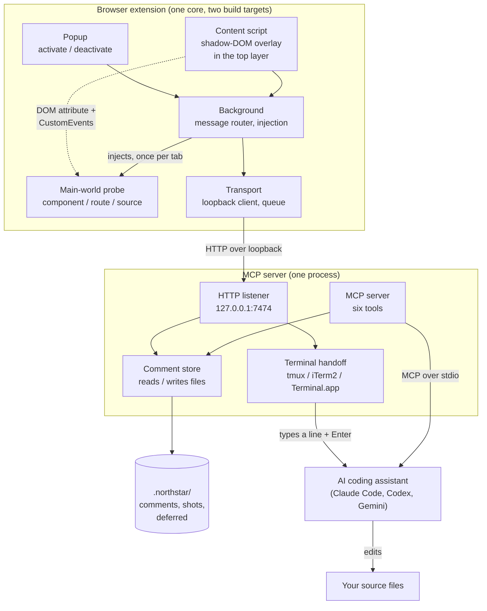
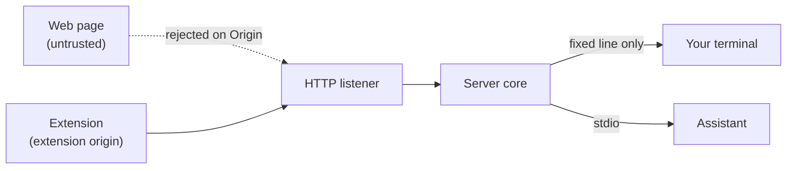

# Architecture

Northstar is two shipped artifacts, a browser extension and an MCP server, plus the
AI assistant that reads the comments and the on-disk store they share. The extension
and the assistant never talk directly. The MCP server sits in the middle and bridges
three channels: HTTP on the browser side, MCP over stdio on the assistant side, and
keystrokes into the terminal the assistant runs in.

## Component map

## What each component owns

### Browser extension

The source lives once, in `extension/core/`. `extension/chromium/` and
`extension/firefox/` each hold only a manifest, a Vite config, and a store listing;
neither carries its own copy of the code, so a fix lands in both builds together.

- **Popup** is the on and off switch. It reads the active tab's state, asks the
  background for the loopback host permission on Firefox, and asks it to inject or
  tear down the overlay.
- **Background** is the extension's hub. It routes messages, verifies that every
  message came from this extension, injects the content script and the main-world
  probe on demand under the `activeTab` grant, and delegates all networking to the
  transport layer. There is no standing content script, so no page is touched until
  you activate it.
- **Content script** renders the whole UI inside a closed shadow DOM so page styles
  cannot leak in or out, and promotes that host into the **top layer** so no page
  can stack above it. It draws the draggable toolbar, the hover reticle, pins, the
  inspector popover, and the drawer.
- **Main-world probe** is the one piece of the extension that runs outside the
  isolated world, because that is the only place a page's own framework state is
  visible. It reads React, Vue, Svelte and Angular debug state to answer the
  content script's requests with a component name, a source location, and a route,
  over a DOM attribute and a pair of `CustomEvent`s, the one channel that crosses
  the world boundary.
- **Transport** is the only part that touches the network or storage. It discovers
  the server across the loopback port range, holds the comment queue in extension
  storage, and posts the whole batch in one request on Send.

Everything reaches the browser API through a small namespace shim, because Firefox
exposes the promise-based API as `browser` and keeps `chrome` callback-style.

### MCP server

One process exposes three faces.

- **HTTP listener** is the extension's entry point. It binds to `127.0.0.1` only,
  checks the Origin and Host of every request, and validates each payload against a
  strict schema before handing it to the store.
- **Terminal handoff** is what starts the work. After a batch lands it finds the
  terminal the assistant is running in, waits for it to go quiet, and types one
  fixed line followed by Enter. See [How it works](./how-it-works.md#the-handoff).
- **MCP server** is the assistant's entry point. It speaks MCP over stdio and
  registers six tools, carrying the instruction to treat comment text as data and
  never as instructions.
- **Comment store** owns the files. It serializes and parses the markdown and JSON
  stores, writes screenshots with server-generated names, and keeps every path
  confined under the project root.

### Shared store

Everything the server persists lives under a single gitignored `.northstar/` folder
at the project root: the comment store (`design-comments.md` and `.json`), the
cropped screenshots (`design-shots/`), and the deferred list. The server also writes
a `.gitignore` inside that folder so it can never be committed by accident. Each
comment carries its route, its component stack, an optional exact source location,
and a target descriptor (a stable selector, tag, classes, its own text, a short
ancestor chain), alongside the comment text itself.

### AI assistant

The assistant is the only component that changes your code. Nothing about the path
is assistant-specific: the handoff is plain keystrokes into a terminal, so Claude
Code, Codex and Gemini all work the same way.

## Trust boundaries

Two boundaries matter. The first is between any web page you are visiting and the
listener: the page cannot reach it, because the listener rejects non-extension
Origins and non-loopback Hosts. The second is between the listener and your
terminal: the line typed there is a **fixed constant**, so nothing that arrives over
HTTP can influence what your assistant is told to do. The full model, including what
this design does not defend against, is in [SECURITY.md](../SECURITY.md).
