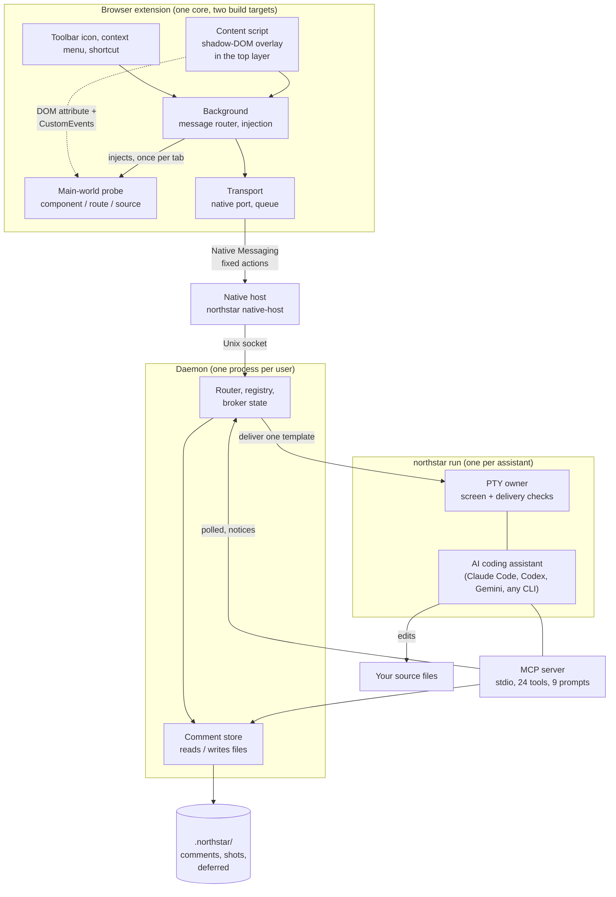
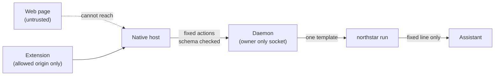
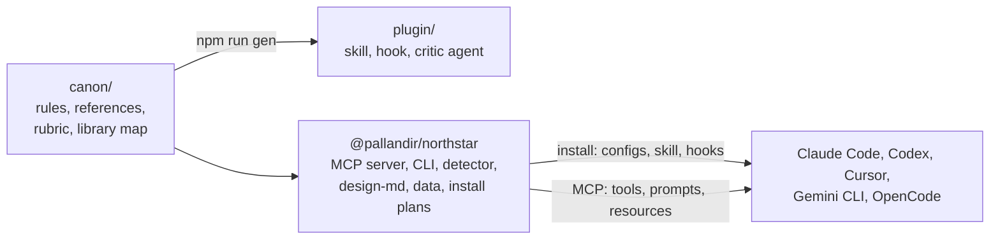

# Architecture

Northstar is a UI design advisory framework for AI agents with a browser comment
handoff. It ships two artifacts, a browser extension and an npm package that holds
the MCP server, the design canon, the local daemon and the command line, plus the AI
assistant that reads the comments and the on-disk store they share. The design
framework is described in [the method](./method.md) and in the last section of this
page. The extension and the assistant never talk directly. A small daemon sits in
the middle and bridges three channels: Native Messaging on the browser side, MCP over
stdio on the assistant side, and the pseudo terminal the assistant runs in.

## Component map

```mermaid
flowchart TB
    subgraph Browser["Browser extension (one core, two build targets)"]
      Icon["Toolbar icon, context menu, shortcut"]
      Worker["Background<br/>message router, injection"]
      Content["Content script<br/>shadow-DOM overlay<br/>in the top layer"]
      Probe["Main-world probe<br/>component / route / source"]
      Transport["Transport<br/>native port, queue"]
      Icon --> Worker
      Content --> Worker
      Content -. "DOM attribute +<br/>CustomEvents" .-> Probe
      Worker -- "injects, once per tab" --> Probe
      Worker --> Transport
    end

    Host["Native host<br/>northstar native-host"]

    subgraph Daemon["Daemon (one process per user)"]
      Core["Router, registry,<br/>broker state"]
      Store["Comment store<br/>reads / writes files"]
      Core --> Store
    end

    subgraph Session["northstar run (one per assistant)"]
      Wrapper["PTY owner<br/>screen + delivery checks"]
      Assistant["AI coding assistant<br/>(Claude Code, Codex, Gemini, any CLI)"]
      Wrapper --- Assistant
    end

    Mcp["MCP server<br/>stdio, 24 tools, 9 prompts"]
    Disk[("<br/>.northstar/<br/>comments, shots,<br/>deferred<br/>")]

    Transport -- "Native Messaging<br/>fixed actions" --> Host
    Host -- "Unix socket" --> Core
    Core -- "deliver one template" --> Wrapper
    Assistant --- Mcp
    Mcp --> Store
    Mcp -- "polled, notices" --> Core
    Store --> Disk
    Assistant -- "edits" --> Repo["Your source files"]
```

## What each component owns

### Browser extension

The source lives once, in `extensions/core/`. `extensions/chromium/` and
`extensions/firefox/` each hold only a manifest, a Vite config, and a store listing;
neither carries its own copy of the code, so a fix lands in both builds together.

- **Toolbar icon** is the on and off switch. There is no popup: clicking the icon
  asks the background to inject the overlay into the tab, or to tear it down if it
  is already showing. The icon title carries the connection status.
- **Background** is the extension's hub. It routes messages, verifies that every
  message came from this extension, injects the content script and the main-world
  probe on demand under the `activeTab` grant, owns the context menu and the keyboard
  shortcut, and delegates all talking to Northstar to the transport layer. There is no
  standing content script, so no page is touched until you activate it.
- **Content script** renders the whole UI inside a closed shadow DOM so page styles
  cannot leak in or out, and promotes that host into the **top layer** so no page
  can stack above it. It draws the draggable toolbar, the hover reticle, pins, the
  inspector popover, and the drawer.
- **Main-world probe** is the one piece of the extension that runs outside the
  isolated world, because that is the only place a page's own framework state is
  visible. It reads React, Vue, Svelte and Angular debug state to answer the
  content script's requests with a component name, a source location, and a route,
  over a DOM attribute and a pair of `CustomEvent`s, the one channel that crosses
  the world boundary.
- **Transport** is the only part that talks to Northstar or touches storage. It holds
  one persistent Native Messaging port, binds a page to a project, holds the comment
  queue in extension storage, and sends the whole batch in one message on Send.
- **Options page** sets the preferred agent, the default template and which project a
  site belongs to, through the same port.

Everything reaches the browser API through a small namespace shim, because Firefox
exposes the promise-based API as `browser` and keeps `chrome` callback-style.

### Native host

`northstar native-host` is started by the browser for the extension, through a small
launcher that pins the Node and Northstar paths. It verifies the caller it was started
with, reads length prefixed JSON frames, rejects anything outside the fixed action list
or the size limits, and forwards the rest to the daemon over the Unix socket. Replies are
kept under what the browser accepts from a helper.

### Daemon

`northstar daemon` is one process per user, started on demand and exiting when idle. It
is the single source of truth for what is running.

- **Registry** holds the sessions (agent, command, folder, process id, last activity)
  and the project folders it has seen. Session metadata is written to
  `~/.northstar/state/`, never prompts.
- **Router** picks the session for a send: the one you named, the only one in the
  project, the preferred agent when it is unique, otherwise it asks you to pick.
- **Broker** keeps per project state: the version, the notices for comments parked as
  needing a plan, the last poll by the assistant, and the last handoff outcome.
- **Comment store access** reads and writes the project's `.northstar/` folder, with
  every path confined under the project root and unknown roots refused.
- **Quick run** starts an installed agent once in its non interactive mode, only when
  you choose it and only when no session runs in the project.

### Session

`northstar run <agent>` starts the assistant in a pseudo terminal that Northstar owns,
mirrors it to your terminal, and registers it with the daemon. A headless terminal
emulator keeps a rendered copy of the screen so the wrapper can tell a prompt from an
idle input. It is the only place a send can write, and it holds your own keystrokes
while it writes.

### MCP server

The MCP server is the assistant's entry point. It speaks MCP over stdio and registers
32 tools and 12 prompts (`resolve-comments` and the eight design
stages), carrying the instruction to treat comment text as data and never as
instructions. It declares no experimental capability, there is no push. It tells the
daemon when the assistant read the comments and when it parked one, and finds its
session by walking up its own process ancestry.

### Shared store

Everything the daemon and the MCP server persist for a project lives under a single
gitignored `.northstar/` folder at the project root: the comment store
(`design-comments.md` and `.json`), the cropped screenshots (`design-shots/`), and the
deferred list. A `.gitignore` inside that folder makes sure it can never be committed by
accident. Each comment carries its route, its component stack, an optional exact source
location, and a target descriptor (a stable selector, tag, classes, its own text, a short
ancestor chain), alongside the comment text itself.

### AI assistant

The assistant is the only component that changes your code. Nothing about the path
is assistant-specific: the handoff is one fixed line written into a terminal Northstar
owns, so Claude Code, Codex, Gemini, OpenCode, Aider, Goose and any other terminal
program work the same way.

## Trust boundaries

```mermaid
flowchart LR
    Page["Web page<br/>(untrusted)"] -. "cannot reach" .-> Host["Native host"]
    Ext["Extension<br/>(allowed origin only)"] --> Host
    Host -- "fixed actions<br/>schema checked" --> Daemon["Daemon<br/>(owner only socket)"]
    Daemon -- "one template" --> Session["northstar run"]
    Session -- "fixed line only" --> Assistant["Assistant"]
```

Two boundaries matter. The first is between any web page you are visiting and the
helper: a page cannot reach a Native Messaging host at all, and the host only answers
the one extension origin and extension id it was registered for. The second is between
the daemon and your assistant: the line written there is one of a few **fixed
constants**, so nothing that arrives from the browser can influence what your assistant
is told to do, and the only terminal it can reach is the one Northstar started. The full
model, including what this design does not defend against, is in
[SECURITY.md](../SECURITY.md).

## The design framework

The framework is built from one source, the canon, and everything an agent sees is
generated or served from it.

```mermaid
flowchart LR
    Canon["canon/<br/>rules, references,<br/>rubric, library map"]
    Plugin["plugin/<br/>skill, hook, critic agent"]
    Pkg["@pallandir/northstar<br/>MCP server, CLI, detector,<br/>design-md, data, install plans"]
    Agent["Claude Code, Codex, Cursor,<br/>Gemini CLI, OpenCode"]

    Canon -- "npm run gen" --> Plugin
    Canon --> Pkg
    Pkg -- "install: configs, skill, hooks" --> Agent
    Pkg -- "MCP: tools, prompts, resources" --> Agent
```

### One source, many outputs

`npm run gen` renders the canon into the Claude plugin, the marketplace manifest, the
rule index. CI runs `npm run gen:check`, which fails
when a generated file has drifted from the canon. The installer imports the same
per agent plans, so the files the repository ships and the files `install` writes
cannot disagree.

### Tools

The server registers every tool at start up and all of them are always available.
The tool modules live in `mcp/src/tools`, one per group. The stage table in the canon
says which tools each stage uses. `NORTHSTAR_PACKS` no longer exists, and a server that
starts with it set stops with the fix.

| Group | Tools |
|---|---|
| core | `northstar_context`, `canon_find`, `canon_read` |
| comments | `list_comments`, `get_comment`, `resolve_comment`, `resolve_comments`, `defer_comment`, `list_deferred`, `clear_resolved` |
| research | `design_search` |
| system | `design_md_init`, `design_md_validate`, `design_md_normalize`, `design_md_export`, `design_system_propose`, `design_tokens_generate` |
| resolve | `resolve_library`, `resolve_font`, `resolve_icon` |
| detect | `slop_scan` |
| critique | `critique_rubric`, `record_critique` |
| page | `page_capture`, `page_audit`, `page_compare` |
| design | `design_intent`, `references_search`, `references_add`, `references_record`, `design_direction`, `design_report` |

The server also serves the canon as resources under `northstar://canon/`, including
a small `northstar://canon/index`, and the design stages and workflows as prompts, so
an agent without the skills installed can still read the same references on demand.

### Canon search

`canon_find` and `canon_read` sit on a catalog built from the canon at start up:
every reference split into sections of about 300 tokens at most, every rule, every
archetype and every resolved conflict. Search is BM25 with field weights (title,
keywords, summary, body), a synonym table in `canon/synonyms.yaml`, a typo correction
over the vocabulary, a boost for the current stage and a cap on how many hits may come
from one reference. Results are cut to a token budget. A topic id returns an outline
so that reading never means loading a whole file.

### Page engine

`mcp/src/page` turns a running page into evidence. A lazily started headless Chrome,
one per server process and closed after two idle minutes, opens each address in a
fresh context with no profile and no cookies. An in page collector returns a plain
JSON snapshot of the visible nodes: boxes, computed type and colour, interactivity,
accessible names and a real keyboard focus check. Everything after that is a pure
function of the snapshot: regions, visual weight, the rules in `page/rules`, the judge
that ranks findings by severity, confidence, impact and repair cost, the repair plan,
the audit loop budget and the comparison of two runs. Screenshots are saved at full
size and returned as crops no longer than 1500 pixels. `playwright-core` is imported
only when a page tool runs, so the extension and the comment tools never load it.

The references side (`mcp/src/references`, `mcp/src/design`) keeps the design intent,
the references and the direction as plain files under `.northstar/design`. Providers
are a search address and an image rewrite, with one generic reader for results pages.
Design DNA is measured from a snapshot or recorded by the agent from an image, and the
direction takes each dimension from the reference that fits the intent best.

### Token generation

`generateTokens` in `mcp/src/design-md` is a pure function. It builds the OKLCH
neutral ramp, the accent and status colours for both themes by searching lightness
until each pair passes its contrast target, the layered elevation levels, the radius
scale, spacing, the type scale and the motion tokens. When a pair cannot pass it
throws an error that names the pair and the fix. `renderDesign` writes the result as
a `DESIGN.md`, and the exporters emit CSS variables with a dark theme block, a Tailwind
theme and DTCG tokens including shadows and motion.

### Boundaries

- Free text from a browser comment never chooses which rules or tools apply.
  The design context block is built from enum fields and a property whitelist only.
- Paths an agent passes to a tool must stay inside the project root.
- The install and uninstall commands change only the files in their plans, back up
  anything they overwrite, refuse to edit a config they cannot parse, and record what
  they did in `~/.northstar/install.json`.
- The scan hook never fails an edit.

