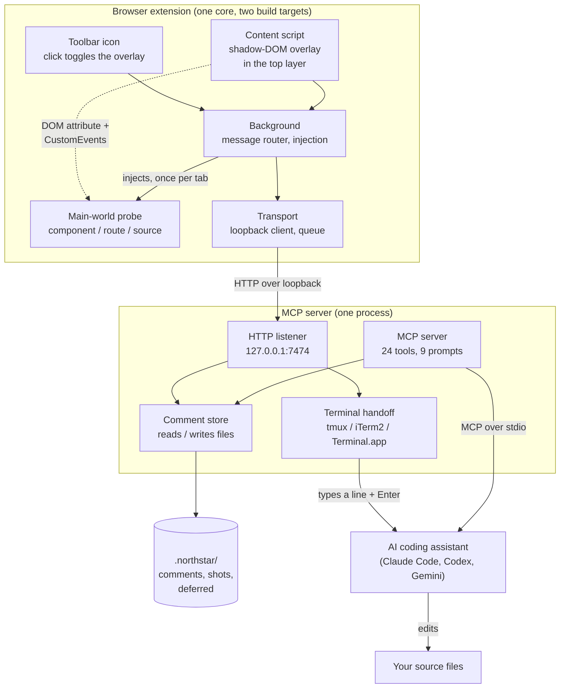
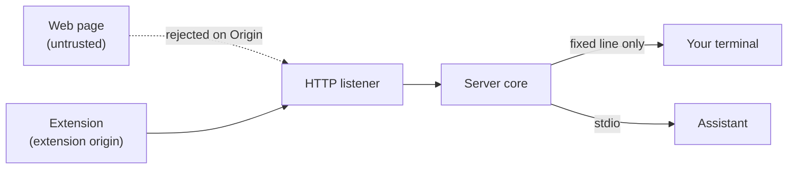
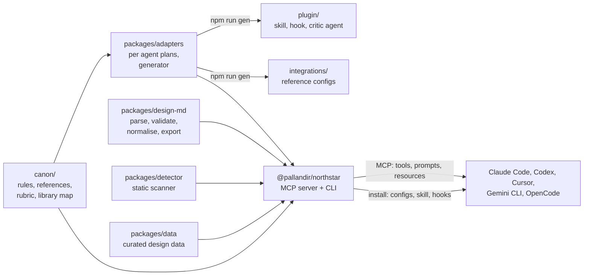

# Architecture

Northstar is a UI design advisory framework for AI agents with a browser comment
channel. It ships two artifacts, a browser extension and an npm package that holds
the MCP server, the design canon and the command line, plus the AI assistant that
reads the comments and the on-disk store they share. The design framework is
described in [the method](./method.md) and in the last section of this page. The extension
and the assistant never talk directly. The MCP server sits in the middle and bridges
three channels: HTTP on the browser side, MCP over stdio on the assistant side, and
keystrokes into the terminal the assistant runs in.

## Component map

```mermaid
flowchart TB
    subgraph Browser["Browser extension (one core, two build targets)"]
      Icon["Toolbar icon<br/>click toggles the overlay"]
      Worker["Background<br/>message router, injection"]
      Content["Content script<br/>shadow-DOM overlay<br/>in the top layer"]
      Probe["Main-world probe<br/>component / route / source"]
      Transport["Transport<br/>loopback client, queue"]
      Icon --> Worker
      Content --> Worker
      Content -. "DOM attribute +<br/>CustomEvents" .-> Probe
      Worker -- "injects, once per tab" --> Probe
      Worker --> Transport
    end

    subgraph Server["MCP server (one process)"]
      Http["HTTP listener<br/>127.0.0.1:7474"]
      Handoff["Terminal handoff<br/>tmux / iTerm2 / Terminal.app"]
      Mcp["MCP server<br/>24 tools, 9 prompts"]
      Store["Comment store<br/>reads / writes files"]
      Http --> Store
      Http --> Handoff
      Mcp --> Store
    end

    Disk[("<br/>.northstar/<br/>comments, shots,<br/>deferred<br/>")]
    Assistant["AI coding assistant<br/>(Claude Code, Codex, Gemini)"]

    Transport -- "HTTP over loopback" --> Http
    Store --> Disk
    Handoff -- "types a line + Enter" --> Assistant
    Mcp -- "MCP over stdio" --> Assistant
    Assistant -- "edits" --> Repo["Your source files"]
```

## What each component owns

### Browser extension

The source lives once, in `extensions/core/`. `extensions/chromium/` and
`extensions/firefox/` each hold only a manifest, a Vite config, and a store listing;
neither carries its own copy of the code, so a fix lands in both builds together.

- **Toolbar icon** is the on and off switch. There is no popup: clicking the icon
  asks the background to inject the overlay into the tab, or to tear it down if it
  is already showing. The icon title carries the connection status.
- **Background** is the extension's hub. It routes messages, verifies that every
  message came from this extension, injects the content script and the main-world
  probe on demand under the `activeTab` grant, and delegates all networking to the
  transport layer. There is no standing content script, so no page is touched until
  you activate it.
- **Content script** renders the whole UI inside a closed shadow DOM so page styles
  cannot leak in or out, and promotes that host into the **top layer** so no page
  can stack above it. It draws the draggable toolbar, the hover reticle, pins, the
  inspector popover, and the drawer.
- **Main-world probe** is the one piece of the extension that runs outside the
  isolated world, because that is the only place a page's own framework state is
  visible. It reads React, Vue, Svelte and Angular debug state to answer the
  content script's requests with a component name, a source location, and a route,
  over a DOM attribute and a pair of `CustomEvent`s, the one channel that crosses
  the world boundary.
- **Transport** is the only part that touches the network or storage. It discovers
  the server across the loopback port range, holds the comment queue in extension
  storage, and posts the whole batch in one request on Send.

Everything reaches the browser API through a small namespace shim, because Firefox
exposes the promise-based API as `browser` and keeps `chrome` callback-style.

### MCP server

One process exposes three faces.

- **HTTP listener** is the extension's entry point. It binds to `127.0.0.1` only,
  checks the Origin, the Host and the pairing token of every request, and validates
  each payload against a strict schema before handing it to the store. Only the
  health check and the pairing page are open.
- **Terminal handoff** is what starts the work. After a batch lands it finds the
  terminal the assistant is running in, waits for it to go quiet, and types one
  fixed line followed by Enter. For Claude Code that line is
  `/mcp__northstar__resolve-comments`. When Claude Code advertises channels, the
  server pushes a channel event first and types only if no agent call follows
  within 8 seconds. See [How it works](./how-it-works.md#the-handoff).
- **MCP server** is the assistant's entry point. It speaks MCP over stdio and
  registers 24 tools across seven packs and nine prompts (`resolve-comments`
  and the eight design stages), carrying the instruction to treat comment text as
  data and never as instructions. It also declares the
  `claude/channel` capability so Claude Code can be triggered by a push.
- **Comment store** owns the files. It serializes and parses the markdown and JSON
  stores, writes screenshots with server-generated names, and keeps every path
  confined under the project root.

### Shared store

Everything the server persists lives under a single gitignored `.northstar/` folder
at the project root: the comment store (`design-comments.md` and `.json`), the
cropped screenshots (`design-shots/`), and the deferred list. The server also writes
a `.gitignore` inside that folder so it can never be committed by accident. Each
comment carries its route, its component stack, an optional exact source location,
and a target descriptor (a stable selector, tag, classes, its own text, a short
ancestor chain), alongside the comment text itself.

### AI assistant

The assistant is the only component that changes your code. Nothing about the path
is assistant-specific: the handoff is plain keystrokes into a terminal, so Claude
Code, Codex and Gemini all work the same way.

## Trust boundaries

```mermaid
flowchart LR
    Page["Web page<br/>(untrusted)"] -. "rejected on Origin" .-> Http["HTTP listener"]
    Ext["Extension<br/>(extension origin)"] --> Http
    Http --> Server["Server core"]
    Server -- "fixed line only" --> Terminal["Your terminal"]
    Server -- "stdio" --> Assistant["Assistant"]
```

Two boundaries matter. The first is between any web page you are visiting and the
listener: the page cannot reach it, because the listener rejects non-extension
Origins and non-loopback Hosts, and requires the pairing token that only a paired
extension holds. The second is between the listener and your
terminal: the line typed there is a **fixed constant**, so nothing that arrives over
HTTP can influence what your assistant is told to do. The full model, including what
this design does not defend against, is in [SECURITY.md](../SECURITY.md).

## The design framework

The framework is built from one source, the canon, and everything an agent sees is
generated or served from it.

```mermaid
flowchart LR
    Canon["canon/<br/>rules, references,<br/>rubric, library map"]
    Data["packages/data<br/>curated design data"]
    Detector["packages/detector<br/>static scanner"]
    DesignMd["packages/design-md<br/>parse, validate,<br/>normalise, export"]
    Adapters["packages/adapters<br/>per agent plans,<br/>generator"]
    Plugin["plugin/<br/>skill, hook, critic agent"]
    Integrations["integrations/<br/>reference configs"]
    Pkg["@pallandir/northstar<br/>MCP server + CLI"]
    Agent["Claude Code, Codex, Cursor,<br/>Gemini CLI, OpenCode"]

    Canon --> Adapters
    Adapters -- "npm run gen" --> Plugin
    Adapters -- "npm run gen" --> Integrations
    Canon --> Pkg
    Data --> Pkg
    Detector --> Pkg
    DesignMd --> Pkg
    Adapters --> Pkg
    Pkg -- "install: configs, skill, hooks" --> Agent
    Pkg -- "MCP: tools, prompts, resources" --> Agent
```

### One source, many outputs

`npm run gen` renders the canon into the Claude plugin, the marketplace manifest, the
rule index and the reference integrations. CI runs `npm run gen:check`, which fails
when a generated file has drifted from the canon. The installer imports the same
per agent plans, so the files the repository ships and the files `install` writes
cannot disagree.

### Tool packs

The server registers every tool at start up and keeps the packs it was not asked
for disabled. Enabling a pack calls the SDK's `enable()`, which sends
`tools/list_changed` to the client. Packs are core, comments, research, system,
resolve, detect and critique. `pack_call` is the escape hatch for clients that never
refresh their tool list.

| Pack | Tools |
|---|---|
| core | `northstar_context`, `enable_packs`, `pack_call`, `canon_find`, `canon_read` |
| comments | `list_comments`, `get_comment`, `resolve_comment`, `resolve_comments`, `defer_comment`, `list_deferred`, `clear_resolved` |
| research | `design_search`, `design_get` |
| system | `design_md_init`, `design_md_validate`, `design_md_normalize`, `design_md_export`, `design_system_propose`, `design_tokens_generate` |
| resolve | `resolve_library`, `resolve_font`, `resolve_icon` |
| detect | `slop_scan`, `explain_rule`, `ui_audit` |
| critique | `critique_rubric`, `record_critique` |

The server also serves the canon as resources under `northstar://canon/`, including
a small `northstar://canon/index`, and the design stages and workflows as prompts, so
an agent without the skills installed can still read the same references on demand.

### Canon search

`canon_find` and `canon_read` sit on a catalog built from the canon at start up:
every reference split into sections of about 300 tokens at most, every rule, every
archetype and every resolved conflict. Search is BM25 with field weights (title,
keywords, summary, body), a synonym table in `canon/synonyms.yaml`, a typo correction
over the vocabulary, a boost for the current stage and a cap on how many hits may come
from one reference. Results are cut to a token budget. A topic id returns an outline
so that reading never means loading a whole file.

### Token generation

`generateTokens` in `packages/design-md` is a pure function. It builds the OKLCH
neutral ramp, the accent and status colours for both themes by searching lightness
until each pair passes its contrast target, the layered elevation levels, the radius
scale, spacing, the type scale and the motion tokens. When a pair cannot pass it
throws an error that names the pair and the fix. `renderDesign` writes the result as
a `DESIGN.md`, and the exporters emit CSS variables with a dark theme block, a Tailwind
theme and DTCG tokens including shadows and motion.

### Boundaries

- Free text from a browser comment never chooses which rules, tools or packs apply.
  The design context block is built from enum fields and a property whitelist only.
- Paths an agent passes to a tool must stay inside the project root.
- The install and uninstall commands change only the files in their plans, back up
  anything they overwrite, refuse to edit a config they cannot parse, and record what
  they did in `~/.northstar/install.json`.
- The scan hook never fails an edit.

