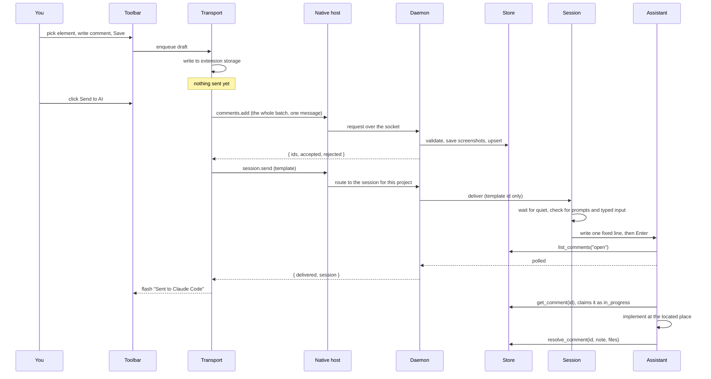
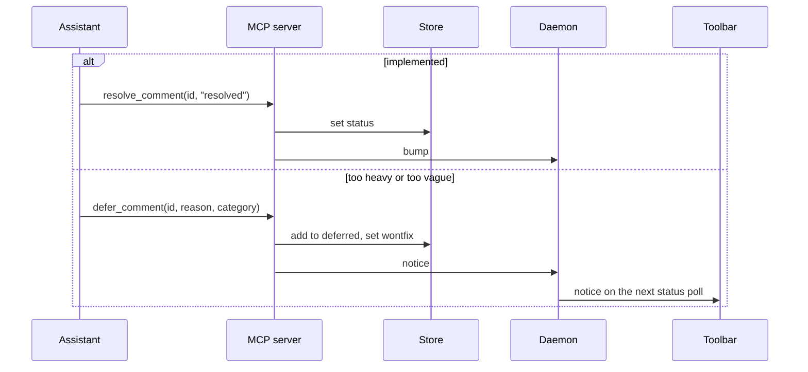
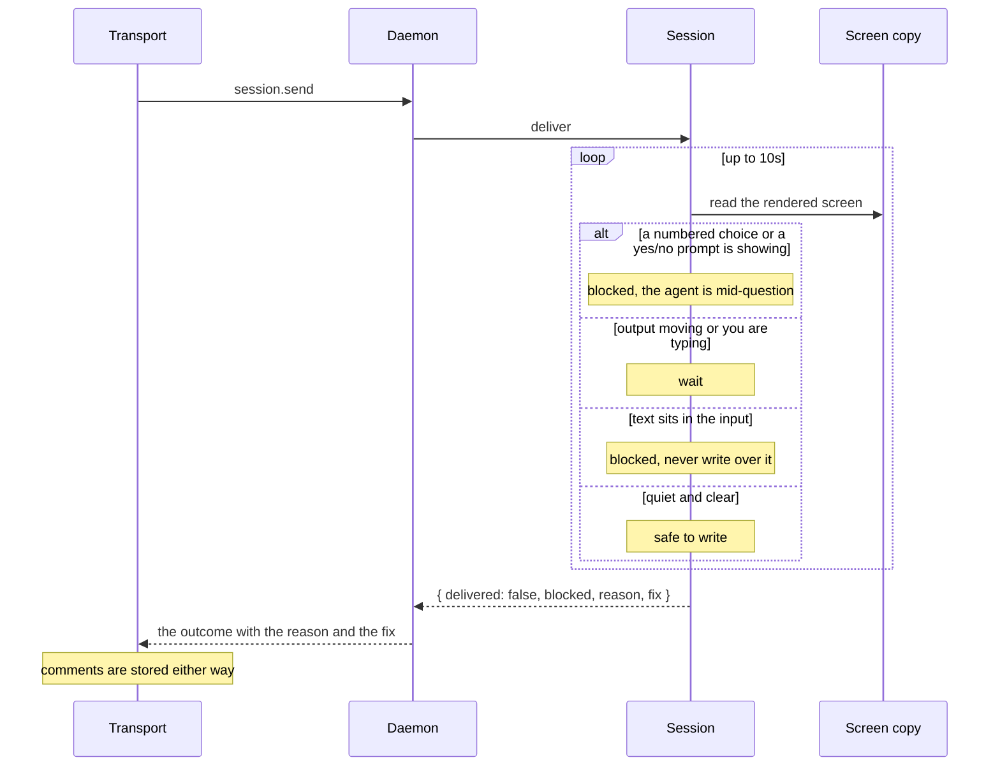
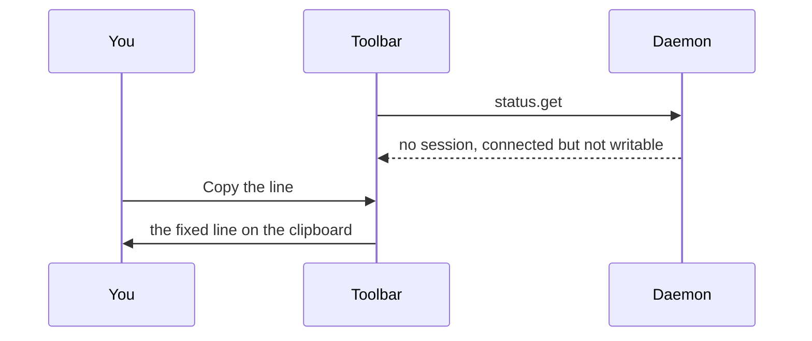

# Flows

These sequence diagrams show the message order for the three things Northstar does:
sending a batch, resolving or deferring work, and the session declining to write. The
participants are the toolbar (in the content script), the extension transport layer, the
native host, the daemon, the session wrapper, the comment store, and the AI assistant.

## 1. Capture a comment and send the batch

Saving a comment is local and instant. Sending is the moment data crosses to the
project and the moment your assistant is told about it.

Save enqueues, Send flushes. A comment that is only saved never reaches the
assistant, which is the single most common reason a batch looks like it was missed.

Delivery is automatic. You are only asked to act when Northstar must not go on, see
the next flow. Sending a selection from the context menu or the shortcut follows the
same path, with the selection stored as one comment first.

## 2. Resolve or defer

After working through a batch the assistant writes the outcomes back through the MCP
tools.

Deferrals split into two kinds: `needs-plan` for changes that are too heavy to do
inline, and `feedback` for comments too vague to act on. Both leave a notice in the
toolbar so you know they were parked, not dropped, and a plan is yours to make.

## 3. The session declines to write

The session never writes blind. If the assistant is showing a choice, has text in its
input, or never goes quiet, your comments are still saved and the toolbar tells you the
agent was not written to, with the reason and the fix.

The check is positive: it writes only once it has seen the screen hold still and clear,
rather than writing unless it recognises trouble.

## 4. No session is running

When no session runs in the project the toolbar says so, and offers two explicit
choices instead of doing either on its own.

