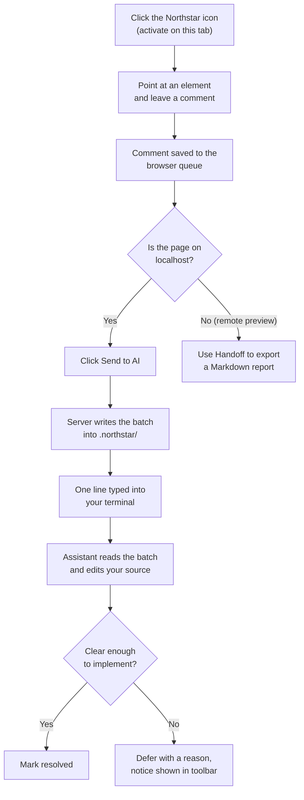
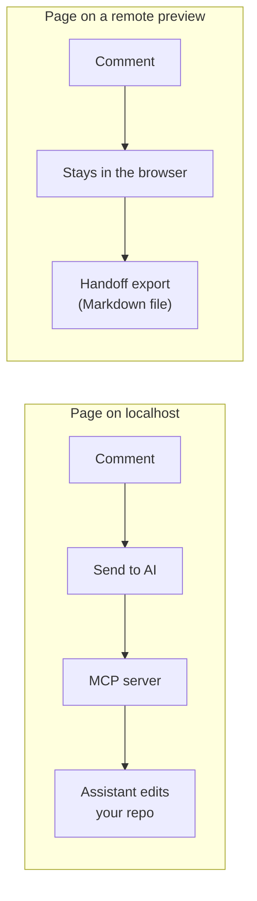

# How Northstar works

Northstar connects three things that normally cannot talk to each other: a web page
in your browser, a comment store on your disk, and an AI coding assistant running in
your terminal. You mark up the running UI, and the assistant closes the marks in the
real source files.

## The short version

You click the Northstar icon to turn it on for the current tab. A small floating
toolbar appears. You point at an element and one popover opens: a Comment tab, a
Text tab, and a Colour tab, so there is one surface for everything you might do to
that element, not three separate menus. Text and colour edits preview live against
the page as you type, and the note is pinned to the element once you save. When you
are ready, you click **Send to AI**. Northstar writes the batch to disk and types one
line into the terminal your assistant is already running in, then presses Enter for
you.

There is nothing to pair and nothing to paste. Nothing leaves your machine either:
the browser and the server meet on `127.0.0.1`.

## The comment lifecycle

Each saved item carries more than the text you typed. Before you even finish reading
the popover's header, Northstar has asked the page itself: a script running in the
page's own main world reads whatever the framework already knows about the element
(React, Vue, Svelte and Angular are covered) and reports back the rendering
component, the route that renders that page, and, wherever the framework tracks it,
an exact `file:line:column`. Nothing needs installing in your app for this; it reads
state that is already there in a development build. Alongside that, Northstar builds
a stable CSS selector, the element's own text, and, only if you asked for one, a
screenshot. That bundle is what lets the assistant land on the right file directly
instead of grepping the codebase for the element.

## Finding the code

A content script runs in an isolated JavaScript world, on purpose: it is how the
overlay stays invisible to the page's own scripts. The cost is that it cannot see the
expando properties a framework attaches to its own DOM nodes, `__reactFiber$…` and
the rest, which is where the component name, the source location and the route
actually live. So Northstar injects a second, much smaller script into the page's
**main world** the moment you activate it, and the two talk across the world
boundary the only way that is possible: a DOM attribute and a pair of
`CustomEvent`s. That script only ever reads; it never assigns to anything on a page
object's prototype, and a reader that finds nothing or hits something unexpected
returns null rather than throwing into your page.

A route can come back one of two ways. When the page's own router state is
reachable (a Next.js page, a matched React Router or Vue Router route), the pattern
is exact and carries its params. Otherwise Northstar infers a pattern from the URL's
own shape, numeric and UUID-looking segments become `:id`, and marks it
`inferred`, so the assistant treats it as a hint rather than a confirmed route file.

## The handoff

There is no supported API for pushing a prompt into a running coding assistant, so
Northstar does what a person would do: it types.

The MCP server is launched by your assistant, which means it inherits the assistant's
environment and can find the terminal underneath it. Three details make this reliable.

**Finding the terminal.** The server is spawned detached, so its own controlling
terminal reads as none. It walks up the process ancestry until it finds one that has
a real terminal device, which is the assistant's. The terminal flavour comes from
environment variables that survive the detach: `TMUX_PANE` for tmux, `TERM_PROGRAM`
for iTerm2 and Terminal.app.

**Waiting for a safe moment.** Before typing anything it reads the visible pane
twice, a quarter second apart, and only proceeds once the two look identical. If it
sees a numbered choice or a yes/no question it refuses outright, because an Enter at
a permission prompt would answer a question you never saw. Your comments are stored
either way and the toolbar tells you they were not announced.

**Pressing Enter separately.** An assistant TUI treats a fast burst of input as a
paste and folds a trailing Enter into the text instead of submitting it. The Enter
goes in as its own write, a fifth of a second later.

Nothing in that path is specific to one assistant. Claude Code, Codex and Gemini all
receive the same keystrokes.

## What gets typed

Always the same fixed line, telling the assistant to read the open comments through
the Northstar MCP tools. Your comment text never goes through the terminal. It is
read from the store by the assistant, and the server instructs it to treat that text
as data describing a UI change rather than as instructions to follow.

## Local pages versus remote previews

Northstar behaves differently depending on where the page is served, because it only
ever edits a local repository.

On a `localhost` dev server the assistant has a real repo to change, so comments flow
straight to the server. On a remote preview there is no local project to edit, so
Northstar keeps the comments in the browser and hands them off as a Markdown file you
can give to any assistant.

## Staying on top of the page

The overlay lives in a closed shadow DOM, and that host is promoted into the browser's
**top layer** with the Popover API. The top layer sits above every stacking context,
so a page cannot hide the comment bubble by bidding higher on `z-index`. Because the
top layer stacks in promotion order, Northstar promotes itself again whenever the page
puts something new up there, and moves inside a page's modal dialog while one is open
so it stays clickable rather than being made inert.
