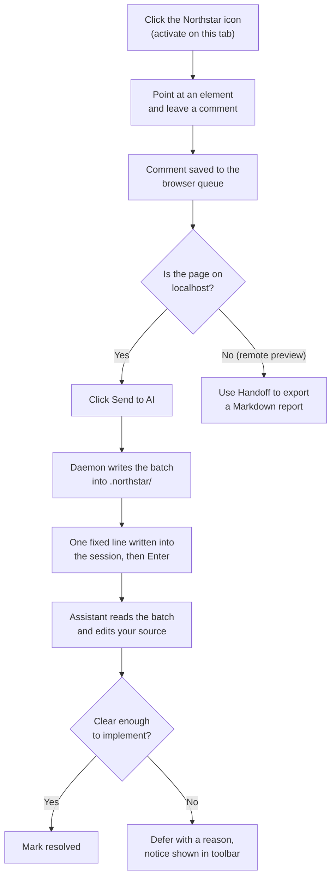
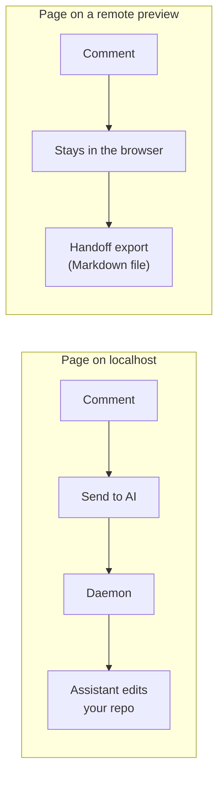

# How Northstar works

Northstar connects three things that normally cannot talk to each other: a web page
in your browser, a comment store on your disk, and an AI coding assistant running in
a terminal Northstar started for it. You mark up the running UI, and the assistant closes the marks in the
real source files.

## The short version

You click the Northstar icon to turn it on for the current tab. A small floating
toolbar appears. You point at an element and one popover opens: a Comment tab, a
Text tab, and a Colour tab, so there is one surface for everything you might do to
that element, not three separate menus. Text and colour edits preview live against
the page as you type, and the note is pinned to the element once you save. When you
are ready, you click **Send to AI**. Northstar writes the batch to disk and writes one
fixed line into the assistant already running in your project, which you started with
`northstar run`, and presses Enter for you.

There is nothing to copy and nothing to pair. Nothing leaves your machine either: the
browser talks to a local helper through Native Messaging, and there is no web server.

## The comment lifecycle

```mermaid
flowchart TD
    A["Click the Northstar icon<br/>(activate on this tab)"] --> B["Point at an element<br/>and leave a comment"]
    B --> C["Comment saved to the<br/>browser queue"]
    C --> D{"Is the page on<br/>localhost?"}
    D -- "Yes" --> E["Click Send to AI"]
    D -- "No (remote preview)" --> F["Use Handoff to export<br/>a Markdown report"]
    E --> G["Daemon writes the batch<br/>into .northstar/"]
    G --> H["One fixed line written into<br/>the session, then Enter"]
    H --> I["Assistant reads the batch<br/>and edits your source"]
    I --> J{"Clear enough<br/>to implement?"}
    J -- "Yes" --> K["Mark resolved"]
    J -- "No" --> L["Defer with a reason,<br/>notice shown in toolbar"]
```

Each saved item carries more than the text you typed. Before you even finish reading
the popover's header, Northstar has asked the page itself: a script running in the
page's own main world reads whatever the framework already knows about the element
(React, Vue, Svelte and Angular are covered) and reports back the rendering
component, the route that renders that page, and, wherever the framework tracks it,
an exact `file:line:column`. Nothing needs installing in your app for this; it reads
state that is already there in a development build. Alongside that, Northstar builds
a stable CSS selector, the element's own text, and, only if you asked for one, a
screenshot. That bundle is what lets the assistant land on the right file directly
instead of grepping the codebase for the element.

## Finding the code

A content script runs in an isolated JavaScript world, on purpose: it is how the
overlay stays invisible to the page's own scripts. The cost is that it cannot see the
expando properties a framework attaches to its own DOM nodes, `__reactFiber$…` and
the rest, which is where the component name, the source location and the route
actually live. So Northstar injects a second, much smaller script into the page's
**main world** the moment you activate it, and the two talk across the world
boundary the only way that is possible: a DOM attribute and a pair of
`CustomEvent`s. That script only ever reads; it never assigns to anything on a page
object's prototype, and a reader that finds nothing or hits something unexpected
returns null rather than throwing into your page.

A route can come back one of two ways. When the page's own router state is
reachable (a Next.js page, a matched React Router or Vue Router route), the pattern
is exact and carries its params. Otherwise Northstar infers a pattern from the URL's
own shape, numeric and UUID-looking segments become `:id`, and marks it
`inferred`, so the assistant treats it as a hint rather than a confirmed route file.

## The handoff

The assistant never polls and never runs a watch mode. It sits idle until you press
**Send to AI**, and then Northstar writes to it by exactly one path: the pseudo
terminal of the session it started. There is no push, no channel, no development flag
and no second path behind the first.

You start the assistant with `northstar run <agent>`, or with plain `claude` and
`codex` after `northstar shell install`. The wrapper puts the assistant in a pseudo
terminal it owns, passes your keystrokes and the output through unchanged, and
registers the session with the daemon. Because Northstar owns that terminal, it is the
only thing a send can write into. It cannot type into another window, and it needs no
accessibility permission, AppleScript or terminal setting.

Every send is confirmed. After the write, the daemon waits up to 20 seconds for the
assistant to call `list_comments`. If it does, the toolbar flashes **Sent to Claude
Code** (or whichever assistant). If it does not, the toolbar says so with the reason and
a fix, and nothing is retried or sent a second way.

The extension picks the project for a page by asking the daemon which project folder
contains the source files the page was built from. A mapping you set in the options
wins, then a project that owns the files, the deepest folder wins a tie, and the
toolbar only asks you to choose when none decides. With two sessions in one project the
daemon uses the one you name, then your preferred agent when it is unique, and
otherwise the toolbar lists the sessions.

Three details make the write reliable.

**Reading the screen.** The wrapper feeds the assistant's output into a headless
terminal emulator, so it knows what the screen looks like, not only the raw bytes. A
numbered choice or a yes or no question means the assistant is mid-question, text after
the prompt mark means something is half typed. In either case Northstar refuses, because
an Enter there would answer a question you never saw or send half a sentence. Your
comments are stored either way and the toolbar tells you why they were not announced.

**Waiting for a safe moment.** It waits until the output has been quiet for half a
second and you have not typed for a moment, up to ten seconds, and only then writes.
Your own keystrokes are held while the line is written and released right after, so
they cannot land inside it.

**Pressing Enter separately.** An assistant TUI treats a fast burst of input as a
paste and folds a trailing Enter into the text instead of submitting it. The Enter
goes in as its own write, after the output has gone quiet again.

Nothing in that path is specific to one assistant. Claude Code, Codex, Gemini, OpenCode,
Aider, Goose and any other terminal program receive the same bytes.

When Northstar cannot write to your assistant, the toolbar offers **Copy the line**. It
copies a start line that makes the assistant run `northstar listen`, which blocks until
Send to AI is clicked, as Impeccable's live mode does with its poll command. Nothing
happens unless you click it.

## What gets written

Always one of six fixed lines (resolve, implement, explain, fix, review, add to task),
telling the assistant to read the open comments through the Northstar MCP tools. Your
comment text, the text you selected on a page, the page URL and the page title never go
through the terminal. They are stored as comment data and read by the assistant, and the
server instructs it to treat that text as data describing a UI change rather than as
instructions to follow.

## Local pages versus remote previews

Northstar behaves differently depending on where the page is served, because it only
ever edits a local repository.

```mermaid
flowchart LR
    subgraph Local["Page on localhost"]
      L1["Comment"] --> L2["Send to AI"] --> L3["Daemon"] --> L4["Assistant edits<br/>your repo"]
    end
    subgraph Remote["Page on a remote preview"]
      R1["Comment"] --> R2["Stays in the browser"] --> R3["Handoff export<br/>(Markdown file)"]
    end
```

On a `localhost` dev server the assistant has a real repo to change, so comments flow
straight to the project. The context menu and the shortcut also work on a remote page
when you map that site to a project in the options. On a remote preview there is no local project to edit, so
Northstar keeps the comments in the browser and hands them off as a Markdown file you
can give to any assistant.

## Staying on top of the page

The overlay lives in a closed shadow DOM, and that host is promoted into the browser's
**top layer** with the Popover API. The top layer sits above every stacking context,
so a page cannot hide the comment bubble by bidding higher on `z-index`. Because the
top layer stacks in promotion order, Northstar promotes itself again whenever the page
puts something new up there, and moves inside a page's modal dialog while one is open
so it stays clickable rather than being made inert.
